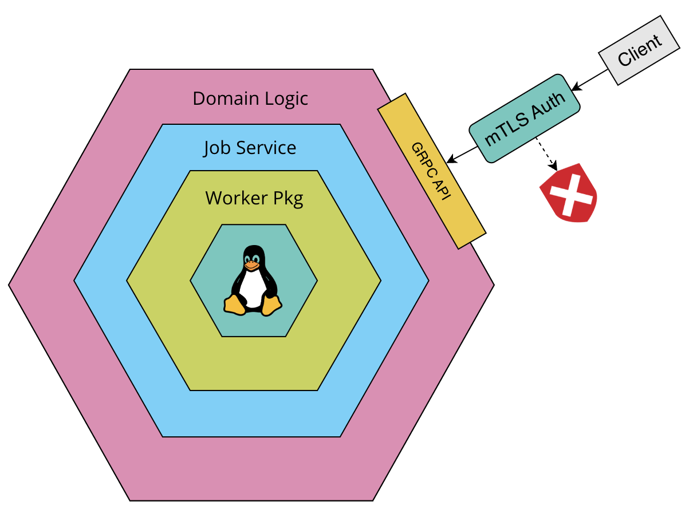
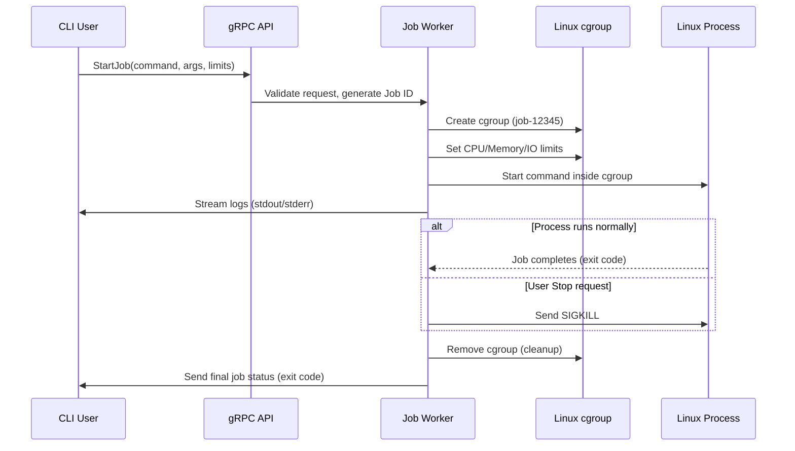

# 📌 Project Name: `Jobber`

## 👤 Author(s):

| Name          | Email               |
|---------------|---------------------|
| Ben Alldridge | jobber@onkraken.net |

## 📅 Date: `10/03/2025`

## 📝 Version: `1.0`

---

# 📖 Overview

## 📌 Summary
Jobber is a Linux job worker with two main attractions;

- Start & stop controls for arbitrary Linux processes.
- Observability for the status, and output of the process.

## 🎯 Goals & 🚫 Non-Goals

- A GRPC-backed API server, which interacts with its host system only, allowing execution of arbitrary Linux commands.
- mTLS authentication /w simple certificate identity RBAC.
- A discrete CLI program for API interface.

The following will **NOT** be included in the initial implementation;

- Process execution extending beyond the boundary of the API server host system.
  - For example, if the API server were to be hosted on a jump-box, and interfaced with a data center or other collection of machines.
- It can be inferred that the strict process boundary also excludes distributed commands.
- Persistence.
  - As a prototype, process status will be stored in volatile memory, and will not persist on server restart.
  - Extensibility will still be a factor, regardless.

---

# 👥 User Statements & Use Cases

## 🎭 Primary Users
This software is intended to be used by both system administrators, and other software requiring use of the functionality this API provides. 

Initial implementation will focus solely on biological actors with one vector, the CLI program included as part of the project.

## 📝 User Scenarios

User scenarios presented in Gherkin syntax for streamlined stakeholder review and comprehension. Primarily serve to verify functionality, security, and obfuscation to implementation;

```gherkin
Feature: Linux Job Worker
  
  Scenario: Authentication Failed
    When Mark queries an API resource
    Then Mark should receive an unauthorised response
    But Mark should not be exposed to any internal implementation
    
  Scenario: Start a job (success)
    Given Mark has auth certificates in place
    When Mark requests to execute a job
    And there are no internal system errors
    Then Mark should receive a success response
    And Mark should receive a job ID
    
  Scenario: Start a job (failed)
    Given Mark has auth certificates in place
    When Mark requests to execute a job
    And the job failed to start
    Then Mark should receive an error response
    But Mark should not receive an error description
    
  Scenario: Stop a job (success)
    Given Mark has auth certificates in place
    When Mark requests to stop a job
    And there are no internal system errors
    Then Mark should receive a success response
    And Mark should receive a message about the updated job status
    
  Scenario: Stop a job (failure)
    Given Mark has auth certificates in place
    When Mark requests to stop a job
    Then Mark should receive an unauthorised response
    And Mark should not receive any job information
    And Mark should not receive any error description
  
  Scenario: Stop a job (not_exist)
    Given Mark has auth certificates in place
    When Mark requests to stop a job
    And there are no internal system errors
    And the job does not exist
    Then Mark should receive an unauthorised response
    And Mark should not be able to determine if the job existed.
    And Mark should not receive any error description

  Scenario: Query a job (success)
    Given Mark has auth certificates in place
    When Mark requests to query a job
    And there are no internal system errors
    And the job exists
    Then Mark should receive a success response
    And Mark should receive the job information
    But Mark should not receive output of the job
  
  Scenario: Query a job (failure)
    Given Mark has auth certificates in place
    When Mark requests to query a job
    And the job exists
    Then Mark should receive an unauthorised response
    And Mark should not reveive any job information
    And Mark should not receive any error description

  Scenario: Query a job (not_exist)
    Given Mark has auth certificates in place
    When Mark requests to query a job
    And there are no internal system errors
    And the job does not exist
    Then Mark should receive an unauthorised response
    And Mark should not be able to determine if the job existed.

  Scenario: Query a job (stream_output)
    Given Mark has auth certificates in place
    When Mark requests to query a job with output stream
    And there are no internal system errors
    And the job exists
    Then Mark should receive a success response
    And Mark should receive an output stream for the job
    But the stream should include the entire output history
  
```

---

# 🏗️ Architectural Overview

## 🖼️ High-Level Diagram



## 🛠️ Key Components & Responsibilities
Describe major modules, services, or layers in the system.

System will be a layered architecture. Domain logic will interact with an abstraction (service) of the lowest level worker package, ensuring the system can be extended.

### Worker Package (Library)
The worker package will use the following interface structure (subject to refinement);

```go
const cgroupRoot = "/sys/fs/cgroup" // Adjust based on cgroup version

// Command represents a job request with resource limits.
type Command struct {
	Name     string            // Command name (e.g., "ping") 
	Args     []string          // Command arguments (e.g., ["-c", "4", "google.com"])
	ResourceLimits CgroupConfig
}

// CgroupConfig defines resource limits for a job using cgroup v2.
type CgroupConfig struct {
        CPUQuota     string // Max CPU usage (e.g., "50000 100000" for 50% CPU)
        MemoryMax    int64  // Max memory limit in bytes (e.g., 500MB = 500*1024*1024)
        MemorySwap   int64  // Max swap usage in bytes (0 = no swap, -1 = unlimited)
        DiskReadBPS  int64  // Max disk read speed in bytes per second (e.g., 5MB/s = 5*1024*1024)
        DiskWriteBPS int64  // Max disk write speed in bytes per second (e.g., 2MB/s = 2*1024*1024)
}

// Job represents a running process with cgroup tracking.
type Job struct {
	id     string             // Job UUID
	cmd    *exec.Cmd
	status *Status
	cgroup string             // cgroup path
	logFile string 
	mu     sync.Mutex         // Per-job lock
}

// Status represents the current state of a Job.
type Status struct {
	Pid      int  // Process identifier
	ExitCode int  // Exit code (-1 if not exited)
	Exited   bool // Whether the process has exited
}

// Worker manages Linux jobs and their lifecycle.
type Worker interface {
	Start(command Command) (jobID string, err error)         // Starts a job
	Stop(jobID string) error                                 // Stops a job
	Query(jobID string) (status Status, err error)          // Queries a job's status
	Stream(ctx context.Context, jobID string) (<-chan []byte, error) // Streams process output
}
```

Key considerations for the worker package are to provide a comprehensive set of features for command control;

* Concurrent-safe job management
  * Will use a map + mutex in the implementation (subject to refinement);
```go
// JobStore safely manages jobs with a map + global lock.
type JobStore struct {
	mu   sync.Mutex // Map modifications only
	jobs map[string]*Job
}
  ```
* Will use the following cgroup controls (cgroup V2 only);
  * cpu.max
  * memory.max
  * io.max
    * We will apply to all disks.

#### Streaming

Streaming output will be handled with temp files (e.g /tmp/job-1234), which will be fed into an unbuffered channel, and eventually steamed to the client in the gRPC response. A new call to `Stream()` will always stream the entire file contents before any new messages. The stream will block until new messages are received, or the connection is closed.

Clients manage their own stream, there is no pub/sub logic or memory buffer of messages, as each client reads from the temp file independent of each other.

### Process Execution Lifecycle (With cgroups)



### GRPC API

The following is a proto definition consistent with the above structure, and captures business logic requirements;

```protobuf
syntax = "proto3";

service JobWorker {
  // Start a job with a specified command, arguments, and resource limits
  rpc StartJob (JobRequest) returns (JobResponse);

  // Stop a running job by job_id
  rpc StopJob (StopRequest) returns (StopResponse);

  // Query the status of a running or completed job
  rpc QueryJob (QueryRequest) returns (JobStatus);

  // Stream real-time job logs
  rpc StreamJobMessages (StreamRequest) returns (stream StreamMessage);
}

// Request to start a new job
message JobRequest {
  string command = 1;              // Program name (e.g., "ping")
  repeated string args = 2;        // Command arguments (e.g., ["-c", "4", "google.com"])
  string cpu_limit = 3;            // CPU limit (e.g., "0.5" = 50% of one core)
  string memory_limit = 4;         // Memory limit (e.g., "500M")
  repeated string io_limit = 5;    // Disk Limit (e.g., ["rbps=2097152", "wbps=max")
}

// Response containing the job ID
message JobResponse {
  string job_id = 1;               // Unique identifier for the job
}

// Request to stop a job
message StopRequest {
  string job_id = 1;
}

// Response for stopping a job
message StopResponse {
  bool success = 1;                // Whether the job was successfully stopped
}

// Request to query job status
message QueryRequest {
  string job_id = 1;
}

// Response containing job status
message JobStatus {
  string job_id = 1;
  int32 pid = 2;                   // Process ID
  int32 exit_code = 3;             // Exit code (-1 if running)
  bool exited = 4;                 // True if process has exited
}

// Request to stream logs
message StreamRequest {
  string job_id = 1;
}

// Stream message response
message StreamMessage {
  bytes data = 1;               // Job output (stdout/stderr)
}
```

### Security

API Authentication will be handled by mTLS. I will include three certificates which carry the authentication _and_ authorisation for the system. The CN (Common Name) will determine the level of access, only if the certificate is first verified and trusted;

```
full-access-1
create-no-stream-access-1
no-access-1
```


#### TLS Version

TLS 1.2+ will be enforced.

#### Cipher Suites
The following collection of ciphers will be used, but not necessarily utilised in the initial prototype;

```
TLS_ECDHE_ECDSA_WITH_AES_256_GCM_SHA384,  // Strongest AES-GCM with ECDSA
TLS_ECDHE_RSA_WITH_AES_256_GCM_SHA384,    // Strongest AES-GCM with RSA
TLS_ECDHE_ECDSA_WITH_CHACHA20_POLY1305,   // Best for mobile (ECDSA)
TLS_ECDHE_RSA_WITH_CHACHA20_POLY1305,     // Best for mobile (RSA)
TLS_ECDHE_RSA_WITH_AES_128_GCM_SHA256,    // AES-GCM fallback
```

#### Additional TLS Config

We could configure elliptical curve preferences, or disable compression, but GO handles both of these well so there is no need for explicit configuration. Compression is disabled by default, and from Go 1.24, the default curve configuration includes the [X25519MLKEM768] hybrid post-quantum key exchange, and I don't believe there is a reason to override it. 

We will, however, disable session tickets in the TLS config;

```go
// Disable session tickets (to prevent key reuse attacks)
	SessionTicketsDisabled: true,
```

#### Crypto Setup

✅ RSA-4096 or ECDSA P-256+ (strong key sizes)  
✅ SHA-256+ for hashing.  
✅ Short-lived certificates (90-180 days is ideal)  
✅ Unique serial numbers for certificates   
✅ Secure Certificate Authority (CA) storage

#### Distribution

Certificate distribution can happen in many ways, see below;

| **Method** | **Security Level** | **Pros** | **Cons** |
|------------|-----------------|----------|----------|
| **Manual Secure Transfer (USB, VPN, SFTP)** | 🔒 High | Simple, no external dependencies | Hard to scale for multiple users |
| **Password-Protected ZIP File** | 🟡 Medium | Easy to distribute | Risky if password is leaked |
| **PKI-Based Certificate Enrollment (e.g., HashiCorp Vault, CFSSL)** | 🔒 High | Fully automated, supports secure revocation | Requires PKI setup |
| **Encrypted Email Attachment (PGP, S/MIME)** | 🟡 Medium | Easy for users, works over email | Users must know how to decrypt |
| **Dedicated API Endpoint for Certificate Issuance** | 🔒 High | Automates certificate requests and renewals | Requires secure authentication |

For this prototype, we will opt for a manual transfer, most likely the certificate being distributed along with the CLI program to the client. It's not optimal, but will suit the purpose of this project. This is a strategy that is relatively straightforward to amend if/once security needs to be hardened and processes formalised.

## Config
Config is provided and parsed from `.env` files. A central configuration package should be included regardless of input method, and the CLI is easily extended in the future.

An example of the config structure (values will differ);

```go
type Config struct {
	ServerTimeout time.Duration `env:"SERVER_TIMEOUT"`
	
	SomeConfigStruct SomeConfigStruct
}

type SomeConfigStruct struct {
	SomeConfigValue `env:"SOME_CONFIG_VALUE"`
	...
}

// Read reads config from environment variables.
func Read() (cfg *Config, err error) {
	cfg = new(Config)

	// Use only `env` and `envDefault` tags, due to simplicity
	// and config generation.
	if err = env.Parse(cfg); err != nil {
		return nil, fmt.Errorf("parsing: %w", err)
	}

	return cfg, nil
}
```

## CLI
### Server
Server CLI remains simple, and arguments are provided with .env files.
#### Start
```
jobber start [-c --config <string>]
```

#### Stop
```
jobber stop
```

### Client
The CLI will communicate with the API server and encapsulate the same business logic. Here are some examples that should best describe how the CLI will be used;

#### Start a job

```
Usage:
  jobcli start <command> [args...]

Example:
  jobcli start ping -c 4 google.com

Output: 
  Job started successfully. 
  Job ID: job-12345
```

#### Stop a job

```
Usage:
  jobcli stop <job_id>

Example:
  jobcli stop job-12345

Output: 
  Job stopped successfully.
```

#### Query a job

```
Usage:
  jobcli query <job_id>

Example:
  jobcli query job-12345

Output: 
  Job ID: job-12345
  PID: 3456
  Exit Code: -1
  Status: Running
```

#### Stream a job

```
Usage:
  jobcli logs <job_id>
  
Example:
  jobcli logs job-12345
  
Output:
  Pinging google.com with 32 bytes of data:
  Reply from 142.250.185.206: bytes=32 time=30ms TTL=118
  Reply from 142.250.185.206: bytes=32 time=31ms TTL=118
  ...
```

---

# 🚀 Implementation Details

## 📆 Milestones & Timeline
1. Build job worker package 
1. Build service abstraction to worker, and core business logic.
1. Build gRPC API on top of business logic.
1. Build CLI program to interact with gRPC API.

## ⚡ Performance Considerations
- By using built-in concurrent safe data structures and procedures, we can ensure performant concurrent access.
- Clustering, data persistence, and network considerations (such as load balancing) should be considered for the future, but are out of scope for this implementation.

## 📈 Scalability & Future Improvements
- Introduce network balancing and routing, clustering, and more robust access controls.
- Add functionality for distributed commands and integration with bespoke corporate tooling such as scripts and external services for data center host discovery etc.
---

# ⚖️ Risks & Trade-offs

## ⚠️ Potential Challenges
- Certificate storage can be a challenge. Centralised management and auditing should be carefully implemented (think secret server)

## 🔄 Alternative Approaches Considered
- Not applicable for this interview challenge I think.

---

# 🛠️ Testing & Deployment

## ✅ Testing Strategy
- Unit tests will ideally be implemented layer-by-layer, with a core testing package used for generating custom states and integrating interface mocks using Mockery. For this challenge I will provide tests for core components only that I feel are important.
- I will implement end-to-end tests if time permits.

## 🚀 Deployment Plan
- This prototype will be deployed and managed manually based on the instructions that will follow the approval of this document.

---

# 📚 Appendix

## 🔗 References & Links
Include relevant links, documents, or additional resources.