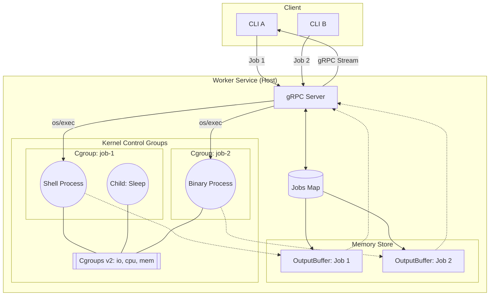
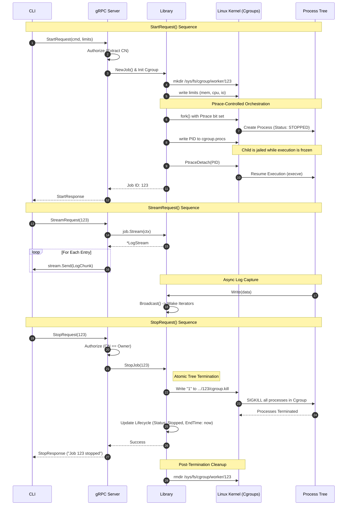

# RFD 0001 - Job Worker Service (Linux)

## Required Approvers
* Interview Panel: `espadolini` `nklaassen` `r0mant`

## What
A prototype job worker service providing a gRPC API for remote execution of isolated Linux processes with real-time log streaming.

## Why
This service provides a secure, resource-constrained environment for executing arbitrary payloads, serving as a foundation for distributed task scheduling.
## Details

### User Experience and CLI Interfaces

The `worker-cli` acts as the primary entry point. Output is designed to be machine-readable where possible while maintaining human-centric status updates.

**Start a job**
User starts a long-running process with resource limits.
```bash
$ worker-cli start -- /bin/sh -c 'while true; do echo hello; sleep 1; done'
> Job initiated successfully.
> ID:      1234-5678-90ab
> Status:  Running
> Created: 2026-01-21T14:00:01Z
>
> To stream logs, run:
> > worker-cli stream 1234-5678-90ab
```

**Query status (Running Job)**
User queries the status of a job. 
```bash
$ worker-cli status 1234-5678-90ab
> Job Information:
>   ID:            1234-5678-90ab
>   Owner:         zephan.johnson
>   Command:       '/bin/sh'
>   Arguments:     ["-c 'while true; do echo hello; sleep 1; done'"]
> 
> Lifecycle:
>   Status:        Running
>   Started:       2026-01-24 12:00:01 UTC
>   Ended:         ---
>   Exit Code:     -1
> 
> Resource Constraints & Usage:
>   CPU Limit:     50%
>   Memory Limit:  100.00 MB
>   Disk I/O:      Read: 10MB/s | Write: 10MB/s
```
s
**Stream output (Running Job)**
User streams the output of a job.
```bash
$ worker-cli stream 1234-5678-90ab
> hello
> hello
> hello
> ^C
```

**Stop a job**
User terminates the job.
```bash
$ worker-cli stop 1234-5678-90ab
> Job ID '1234-5678-90ab' stopped successfully.
```

**Stream output (Stopped Job)**
User streams the output of a job.
```bash
$ worker-cli stream 1234-5678-90ab
> hello
> hello
> hello
> hello
> hello
```

**Query status**
User queries the status of a job (Stopped Job). 
```bash
$ worker-cli status 1234-5678-90ab
> Job Information:
>   ID:            1234-5678-90ab
>   Owner:         zephan.johnson
>   Command:       /bin/sh -c 'while true; do echo hello; sleep 1; done'
> 
> Lifecycle:
>   Status:        stopped
>   Started:       2026-01-24 12:00:01 UTC
>   Ended:         2026-01-24 12:00:06 UTC
>   Exit Code:     0
>
> Resource Constraints & Usage:
>   CPU Limit:     50%
>   Memory Limit:  100.00 MB
>   Disk I/O:      Read: 10MB/s | Write: 10MB/s
```

### Architecture and Subsystems
The system consists of three main components:
1.  **Worker Library**: A low-level wrapper around `os/exec` and `syscall`. It manages the process lifecycle, namespace isolation, and Cgroup attachment.
      * Process Execution: [os/exec](https://pkg.go.dev/os/exec)
      * Process Output Streaming: Use internal `OutputBuffer` struct that will handle async read/writes from the Client and Processes. 
2.  **gRPC Server**: An API layer to access the Worker Library. It handles mTLS termination, identity extraction from certificates, and maps gRPC streams to the library’s internal broadcasters.
      * gRPC Library: [grpc](https://pkg.go.dev/google.golang.org/grpc)
3.  **CLI**: A Cobra-based implementation that manages the mTLS handshake and renders gRPC stream chunks to the local TTY.
      * CLI Library: [cobra](https://pkg.go.dev/github.com/spf13/cobra)

#### Architecture Diagram


#### Lifecycle Sequence Diagram


### Implementation
#### Process Orchestration
We utilize `os/exec.Cmd` to execute processes directly on the host. To ensure a zero-race environment, the library employs a **Ptrace-Controlled Orchestration** pattern. 
In this model, the parent process (the Worker Server) initiates the child with the `Ptrace` bit set. This causes the Linux kernel to suspend the child process at the very first instruction of the `execve` syscall. While the child is frozen, the parent safely performs the "jailing" operations (moving the PID into Cgroups). Once the jail is secure, the parent issues a `PtraceDetach`, allowing the child to resume execution. This ensures the target binary never executes a single cycle outside of its resource constraints.
* Technical Requirements:
  *  ***Resource Constraints***: We will leverage Cgroups v2. Upon job initiation, the library creates a unique Cgroup leaf node at `/sys/fs/cgroup/worker/<job_id>/`. Limits are written to `memory.max`, `cpu.max`, `io.max` before the process is migrated into the group to ensure each process is resource constrained before fork() is called.
      * Process Memory & CPU: Limits are written to `memory.max` and `cpu.max` before the process starts.
      * Disk I/O: Throughput and IOPS are throttled via `io.max`. This file accepts structured strings in the format `$MAJ:$MIN rbps=$N wbps=$N`, allowing the library to cap the bytes-per-second and operations-per-second for specific block devices. The worker resolves the target block device at runtime. Limits are applied to the block device hosting the job's working directory.
  *  ***Process Tree Termination***: To prevent orphaned processes and avoid the PID-reuse races inherent in signaling process groups, the library will leverage `cgroup.kill` to terminate the entire process group```

##### Start Process Example
**NOTE** *Implementation Clarity: For the sake of readability, the following Go code examples omit exhaustive error handling, and certain edge-case validations. A production implementation would include comprehensive error wrapping and defensive checks for all syscalls and filesystem operations.*

```go
// Start initiates the process execution using Ptrace-Controlled Orchestration
// to eliminate the race condition between process start and Cgroup attachment.
func (j *Job) Start() error {
    // Initialize Cgroup leaf and apply limits
    j.initCgroup();

    // Prepare the execution command
    j.Proc.cmd = exec.Command(j.Specs.Command, j.Specs.Arguments...)
    j.Proc.cmd.Stdout = j.Stream.Stdout()
    j.Proc.cmd.Stderr = j.Stream.Stderr()

    // Set Ptrace to true to freeze the child immediately after fork
    j.Proc.cmd.SysProcAttr = &syscall.SysProcAttr{
        Ptrace:    true,            // By starting the process with Ptrace, the parent can intercept it before execution, attach it to the cgroup, and then detach to resume execution. This eliminates any race condition where the process runs without limits, though it introduces minor overhead.
    }

    // Set the Working Directory for the child process
    j.Proc.cmd.Dir = j.Specs.WorkingDirectory

    // Parent-Initiated Jailing
    // Move the frozen PID into the cgroup.procs file
    j.Proc.cmd.Start()
    pid := j.Proc.cmd.Process.Pid
    if err := j.attachToCgroup(pid); err != nil {
        j.Proc.cmd.Process.Kill()
        return err
    }

    // Resume the child
    // The child transitions from the 'Stopped' state to 'Running' inside the jail.
    if err := syscall.PtraceDetach(pid); err != nil {
        return fmt.Errorf("failed to resume child: %w", err)
    }

    // Handle Zombie Processes
    go j.reap()

    // Update Job Status
    j.UpdateStatus(StatusRunning)
    return nil
}

```

##### Start Helpers
```go
// initCgroup initializes the Cgroup v2 directory hierarchy and applies
// memory, CPU, and IO controller limits before process attachment.
func (j *Job) initCgroup() error { ... }

// attachToCgroup moves the target PID into the job's dedicated cgroup.procs
// and detaches ptrace to resume execution in the constrained environment.
func (j *Job) attachToCgroup(pid int) error { ... }

// reap blocks on the process exit and handles resource cleanup, exit code
// recording, and Cgroup directory removal.
func (j *Job) reap() { ... }
```

##### Stop Process Example
```go
func (j *Job) Stop() error {
    j.Lock()
    defer j.Unlock()

    // Check if the job is already finished to avoid unnecessary syscalls
    if j.State.Status != StatusRunning {
        return nil
    }

    // Atomic Termination via Cgroup v2
    // Writing "1" to cgroup.kill kills every process in the cgroup immediately.
    // NOTE: This requires Linux kernel 5.14+.
    cgroupKillPath := filepath.Join("/sys/fs/cgroup/worker", j.ID, "cgroup.kill")
    err := os.WriteFile(cgroupKillPath, []byte("1"), 0644)
    if err != nil {
        // Fallback: If cgroup.kill fails (e.g., older kernel), use traditional SIGKILL
        if j.Proc.cmd.Process != nil {
            return j.Proc.cmd.Process.Kill()
        }
        return fmt.Errorf("failed to terminate cgroup: %w", err)
    }

    // Update Lifecycle State
    j.UpdateStatus(StatusStopped)
    return nil
}
```
#### Output Streaming & Broadcasting 
The `OutputBuffer` is implemented as a synchronized, in-memory store.
* Technical Requirements:
  *  ***Replay***: Each `Job` maintains a slice of `LogEntry` structs containing all historical output. New gRPC callers first read the existing buffer from their current offset.
  *  ***Signaling***: We use `sync.Cond` for the broadcasting layer. When the library reads a chunk from the process pipes, it appends to the buffer and triggers `Broadcast()`. The `OutputBuffer` exposes a `Stream(ctx)` method which returns a `LogStream` iterator. This method encapsulates the complexity of `sync.Cond`, handling historical replay, live updates, and context cancellation internally, providing a simple pull-based consumption model for the gRPC server.

##### `OutputBuffer.Write` Implementation for OutputBuffer Example
```go
// Write appends data and wakes up all waiting streamers.
func (b *OutputBuffer) Write(data []byte) {
	b.mu.Lock()
	defer b.mu.Unlock()

	b.entries = append(b.entries, LogEntry{Data: data})
	b.cond.Broadcast() // 🔔 Wake up all consumers
}
```

##### `OutputBuffer.Stream` Implementation Example
```go

// Stream returns a channel that receives all past and future logs.
func (b *OutputBuffer) Stream(ctx context.Context) <-chan LogEntry {
	out := make(chan LogEntry)
	
	go func() {
		defer close(out)
		offset := 0 // Track this consumer's position in the history

		b.mu.RLock()
		defer b.mu.RUnlock()

		for {
			// 1. Replay History: Send all available entries
			// (Lock is released during send to avoid blocking the writer)
			for ; offset < len(b.entries); offset++ {
				out <- b.entries[offset]
			}

			// 2. Check for End of Stream
			if b.closed {
				return
			}

			// 3. Wait: Sleep until new data arrives (signaled via Broadcast)
			b.cond.Wait()
		}
	}()

	return out
}
```

##### `gRPCServer.Stream` Implementation Example
```go
// Stream captures the logic for a gRPC server sending logs to a client.
func (s *workerServer) Stream(req *StreamRequest, stream JobWorker_StreamServer) error {
    job := s.store.Get(req.JobId)
    
    // The Stream method returns a channel that handles all locking and 
    // synchronization internally. It closes when the job finishes or 
    // the context is canceled.
    logChan := job.Stream.Stream(stream.Context())

    for entry := range logChan {
        if err := stream.Send(mapToProto(entry)); err != nil {
            return err
        }
    }
    return nil
}
```

#### Security & Identity
Security and Identity are paramount to protecting our servers from malicious actors. The following requirements ensure we protect the server:
* Technical Requirements:
  *  ***mTLS 1.3***: Mandatory mutual TLS using a shared internal CA. Go's `crypto/tls` package enforces a modern, secure set of suites automatically.
  *  ***Identity-Based Auth***: The server extracts the `Subject.CommonName` (CN) from the client certificate. This CN is treated as the "Owner." Any request to `Stop`, `Status`, or `Stream` a job is rejected if the caller's CN does not match the job's `ExecutionSpecs.OwnerCommonName`.

##### Verify Certificate Example
```go
func (s *workerServer) Authorize(ctx context.Context, jobID string) error {
    // Extract Peer info from gRPC context
    p, _ := peer.FromContext(ctx)
    tlsInfo := p.AuthInfo.(credentials.TLSInfo)
    
    // Extract Common Name (CN) from the client certificate
    clientCN := tlsInfo.State.PeerCertificates[0].Subject.CommonName
    
    // Verify Ownership: Only the creator can manage the job
    job := s.store.Get(jobID)
    if job.OwnerCommonName != clientCN {
        return status.Error(codes.PermissionDenied, "Identity mismatch")
    }
    
    return nil
}
```

#### Server Consideration
Since the Server itself will be serving concurrent traffic with many clients, inflight goroutines should be sandboxed as well. We will need to consider error handling to accommodate.
* Technical Requirements:
  *  ***Error Handling***: Each `Job` will have a panic handler that will gracefully log errors to a channel before letting each process goroutine safely exit.

##### Panic Handler Example
```go
// HandlePanic ensures that a failure in a management goroutine (like log capture)
// does not terminate the underlying OS process or incorrectly modify the job's state.
func (s *workerServer) HandlePanic(jobID string) {
    if r := recover(); r != nil {
        // Log the critical management failure with a full stack trace.
        // We do not call job.Stop() or modify job.State here, as the 
        // underlying process is still healthy in its Cgroup.
        log.Printf("[CRITICAL] Management goroutine panic for Job %s: %v\nStack: %s", jobID, r, debug.Stack())
    }
}

// Example usage in the orchestration:
go func() {
    defer s.HandlePanic(job.ID)
    s.streamOutput(job)
}()
```

### Library Structs
The bulk of the data that will be kept in memory will be in the `Job` struct. Each job will have a status, as well as other pieces of metadata like ID, job commands and arguments.
```go
// Job is the container for each process initiated by a client.
// It contains the metadata for the Command, Process, and Lifecycle. It also provides access to the Log Stream buffer.
type Job struct {
	sync.RWMutex

	// ID is a unique UUID generated for the job, distinct from the OS PID. This is the same ID the client will be provided to manage processes
	ID string
	// Specs holds the command from the client
	Specs ExecutionSpecs
	// Proc holds live handles to the running process.
	Proc ProcessHandle
	// State tracks the current status and timing of the job.
	State Lifecycle
	// Limit defines the resource boundaries for the process on the linux system.
	Limit ResourceLimits
	// Stream manages the in-memory buffer for replayable output.
	Stream *OutputBuffer
}

// OutputSource is the source type of each log entry
type OutputSource int32

const (
  // OutputSourceUnspecified indicates the source is unspecified
  OutputSourceUnspecified OutputSource = 0
  // OutputSourceStdout is Standard Output from the process.
	OutputSourceStdout      OutputSource = 1
  // OutputSourceStderr is Standard Error from the process.
	OutputSourceStderr      OutputSource = 2
)

// LogEntry preserves the metadata for a specific chunk of output.
type LogEntry struct {
  // Data contains an unstructured byte array for the current entry from the process
	Data      []byte
  // Source is the type of output log from the process
	Source    OutputSource
  // Timestamp is the timestamp of the Capture event for this log
	Timestamp time.Time
}

// OutputBuffer implements a thread-safe, multi-consumer broadcaster for process output
type OutputBuffer struct {
	sync.RWMutex
	// cond is a condition variable used to wake up dormant client streamers when new data arrives.
	cond *sync.Cond
	// entries is the in-memory store of all stdout/stderr produced by the process.
  entries []LogEntry
	// closed indicates the process has finished writing to the buffer.
	closed bool
}
```

#### Subtypes
```go
// JobStatus represents the current lifecycle state of a worker job.
type JobStatus int32

const (
  // StatusUnspecified indicates the status is unspecified
  StatusUnspecified JobStatus = 0
  // StatusRunning indicates the process has started and is currently active.
	StatusRunning     JobStatus = 1
  // StatusStopped indicates the process was manually terminated by a user request.
	StatusStopped     JobStatus = 2
  // StatusCompleted indicates the process exited on its own with a zero exit code.
	StatusCompleted   JobStatus = 3
  // StatusFailed indicates the process exited with a non-zero exit code or system error.
	StatusFailed      JobStatus = 4
)

// ExecutionSpecs defines the parameters provided by the client when a job is first created.
type ExecutionSpecs struct {
	// Command is the path to the executable to be run.
	Command string
  // Arguments is the path to the executable to be run.
	Arguments []string
  // WorkingDirectory is the path where the process will execute
  WorkingDirectory string
	// OwnerCommonName is the Common Name extracted from the client's TLS certificate, used for ownership-based authorization.
	OwnerCommonName string
}

// ResourceLimits defines the kernel-level constraints applied to a job.
// These are implemented via Cgroups on Linux.
type ResourceLimits struct {
	// MemoryLimitBytes is the maximum physical memory the process tree can consume.
	MemoryLimitBytes int64
	// CPULimitPercent is the maximum CPU usage allowed (e.g., 0.5 for 50% of a core).
	CPULimitPercent float64
  // IOLimit is the maximum IO Read and Write for the process. It Requires specific properties to generate a string necessary for linux CGroup limits
	IOLimit LinuxIOLimit
}

// IOLimit is the spec needed to generate a structured string for the linux cgroup.
type LinuxIOLimit struct {
    Major      int
    Minor      int
    ReadBPS    uint64
    WriteBPS  uint32
}

func (l IOLimit) String() string {
    return fmt.Sprintf("%d:%d rbps=%d wbps=%d", l.Major, l.Minor, l.ReadBPS, l.WriteBPS)
}

// getDeviceMajorMinor uses teh syscall.Stat() function to get the major and minor version of the mount. 
func getDeviceMajorMinor(path string) (uint32, uint32, error) {
	var stat syscall.Stat_t
	if err := syscall.Stat(path, &stat); err != nil {
		return 0, 0, err
	}

	// stat.Rdev contains the device ID for device nodes
	major := unix.Major(stat.Rdev)
	minor := unix.Minor(stat.Rdev)

	return major, minor, nil
}

// ProcessHandle maintains the live OS-level handles and controls for the process.
type ProcessHandle struct {
	// PID is the Operating System's Process ID.
	PID int
	// cmd is the underlying Go exec.Cmd instance managing the lifecycle.
	cmd *exec.Cmd
	// cancel is the context cancellation function used to signal a stop.
	cancel context.CancelFunc
}

// Lifecycle tracks the temporal state and exit results of a job.
type Lifecycle struct {
	// Status is the current machine-state of the job.
	Status JobStatus
	// ExitCode is the exit code returned by the process upon termination.
	ExitCode int
	// StartTime is the UTC timestamp when the process was successfully started.
	StartTime time.Time
	// EndTime is the UTC timestamp when the process was ended.
	EndTime *time.Time
}
```


### Client <> Server gRPC Specification
The client to server schema will be using protobuf to support a standard gRPC API. The Start/Stop/Status apis will support synchronous job management, while Stream will return a stream of logs until the client wants to stop listening.

#### Service Definition
```protobuf
service JobWorker {
  // Starts a new isolated process
  rpc Start(StartRequest) returns (StartResponse);
  
  // Terminates a running process
  rpc Stop(StopRequest) returns (StopResponse);
  
  // Returns high-level metadata and resource usage
  rpc Status(StatusRequest) returns (StatusResponse);
  
  // Streams interleaved stdout/stderr with replay capability
  rpc Stream(StreamRequest) returns (stream LogChunk);
}
```

#### Start Job
```protobuf
message StartRequest {
  string command = 1;
  repeated string args = 2;
  string working_directory = 3;
}

message StartResponse {
  string job_id = 1;
  string status = 2;
  google.protobuf.Timestamp created_at = 3;
}
```

#### Stop Job
```protobuf
message StopRequest {
  string job_id = 1;
}

message StopResponse {
  string message = 1;
}
```

#### Get Status
```protobuf
message StatusRequest {
  string job_id = 1;
}

// Resource limits to be enforced via Cgroups v2
message ResourceLimits {
  uint64 memory_bytes = 1;
  uint32 cpu_percent = 2; 
  uint64 disk_read_bps = 3;
  uint64 disk_write_bps = 4;
}

message StatusResponse {
  // Job Info
  string job_id = 1;
  string owner = 2;
  string command = 3;
  repeated string args = 4;

  // Lifecycle
  enum JobStatus {
    STATUS_UNSPECIFIED = 0;
    RUNNING = 1;
    STOPPED = 2;
    COMPLETED = 3;
    FAILED = 4;
  }
  JobStatus status = 5;
  google.protobuf.Timestamp started_at = 6;
  optional google.protobuf.Timestamp ended_at = 7;
  int32 exit_code = 8;                    

  // Constraints
  ResourceLimits limits = 9;
}
```

#### Stream Job
```protobuf
message StreamRequest {
  string job_id = 1;
}

message LogChunk {
  bytes data = 1;
  // Distinguishes between output streams
  enum Source {
    // Zero value is reserved for "not specified" to avoid ambiguity
    SOURCE_UNSPECIFIED = 0;
    STDOUT = 1;
    STDERR = 2;
  }
  Source source = 2;
  google.protobuf.Timestamp timestamp = 3;
}
```
### Test Plan
To provide some testing coverage we will have a variety of Unit and Integration Tests. For Unit Tests we will cover main apis and key arguments. For Integration test we will cover requirement level components of the system, including Lifecycle, Resource Limitations, Concurrency, and Security. Along with the happy paths we will test some error scenarios
*   **Unit Tests:** Verify `OutputBuffer` logic (concurrency, buffer wraparound) and Cgroup wrapper logic.
*   **Integration Tests:**
    *   **Lifecycle:** Start -> Status -> Stream -> Stop.
    *   **Resource Limits:** Run a "memory leaker" test binary and verify it is terminated by the OS/cgroup when limits are hit.
    *   **Concurrency:** multiple clients streaming the same job; multiple jobs running in parallel.
    *   **Security:** Verify clients with invalid certificates are rejected.
    *   **Graceful Shutdown:** Verify Server shuts down and closes and exits connections and process gracefully
    *   **Panic Handler:** Verify Server handles errors and panics gracefully
---

<!--
RFD 0001 - Job Worker Service
-->