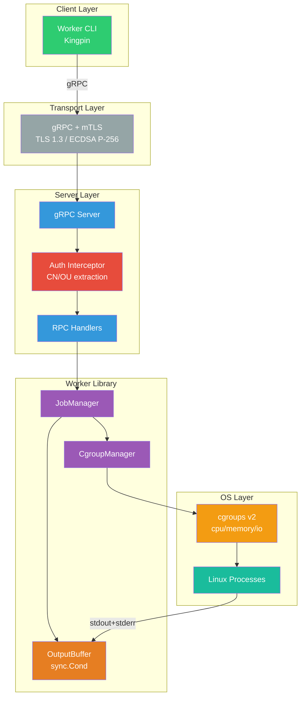
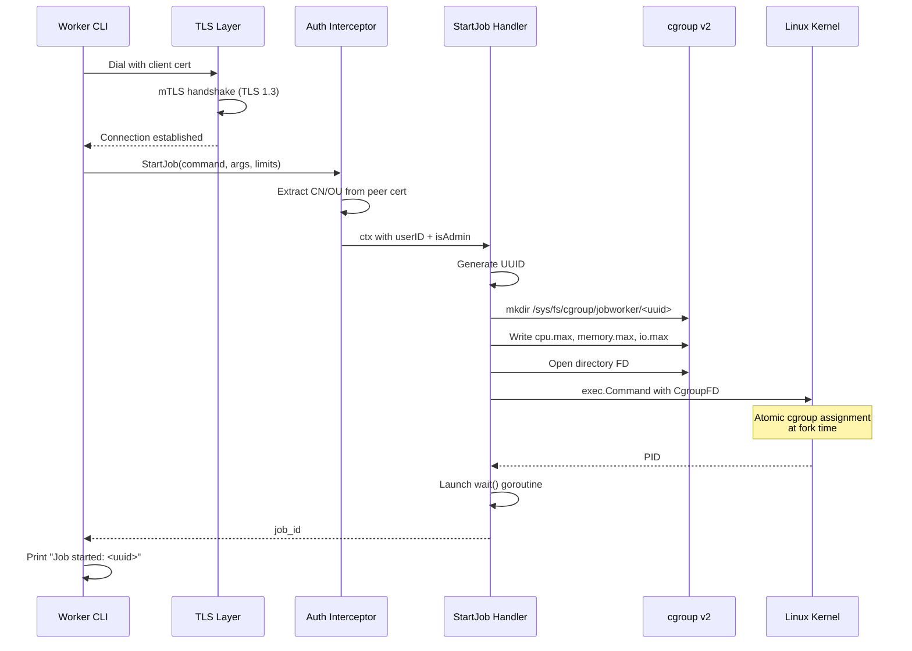

# Job Worker Service

A secure, gRPC-based job worker service for executing and managing Linux processes with mTLS authentication, real-time output streaming, and process grouping via cgroups v2.

## Overview

The Job Worker is a lightweight, self-contained job execution platform where multiple clients can submit and observe long-running tasks without requiring full container orchestration overhead. By embedding the worker library directly in the server, it minimizes operational complexity while maintaining security through certificate-based access control and per-user job authorization.

## Architecture

The system follows a **client-server architecture** with the server embedding the worker library. All communication is secured via mTLS (TLS 1.3).



### Request Flow: Starting a Job



### Components

| Component | Description |
|-----------|-------------|
| **Worker CLI** | Kingpin-based CLI for submitting and managing jobs |
| **gRPC Server** | Handles client requests over TLS 1.3 with mTLS |
| **Auth Interceptor** | Extracts client identity (CN/OU) from X.509 certificates |
| **JobManager** | Core job lifecycle management (start, stop, status) |
| **CgroupManager** | Creates cgroups, sets resource limits, handles termination |
| **OutputBuffer** | In-memory buffer with real-time streaming via `sync.Cond` |

### Technology Choices

| Component | Choice | Why |
|-----------|--------|-----|
| **Language** | Go | First-class concurrency, strong stdlib, static binary |
| **Transport** | gRPC | Native streaming, efficient protobuf, built-in TLS |
| **Auth** | mTLS | No password management, mutual verification |
| **CLI** | Kingpin | Env var support, type-safe flags, subcommands |
| **Process Mgmt** | cgroups v2 | Process grouping, resource limits, unified termination |
| **Job IDs** | UUID v4 | No coordination, globally unique |
| **Notification** | sync.Cond | Zero-allocation, no polling |

## Core Features

| Feature | Description |
|---------|-------------|
| **Process Execution** | Start arbitrary Linux processes with command and arguments |
| **Resource Limits** | CPU, memory, and disk I/O limits per job via cgroups v2 |
| **Job Management** | Stop running jobs, query status |
| **Output Streaming** | Real-time combined stdout/stderr streaming from byte 0 |
| **mTLS Authentication** | Mutual TLS with X.509 client certificates (TLS 1.3 only) |
| **Per-User Isolation** | Users can only access their own jobs; admins can access all |
| **Process Tree Control** | Kill entire process trees atomically via cgroup.kill |
| **Binary Output** | Raw byte streaming with no encoding assumptions |

## Project Structure

```
job-worker/
├── api/proto/           # Protocol Buffer definitions
├── cmd/
│   ├── worker-server/   # gRPC server binary
│   └── worker-cli/      # CLI client binary
├── pkg/
│   ├── client/          # Go client library
│   ├── proto/           # Generated protobuf code
│   └── worker/          # Core worker library (Job, JobManager, CgroupManager, OutputBuffer)
├── internal/server/     # gRPC server implementation + auth interceptors
├── certs/               # TLS certificates (generated via make certs)
└── docs/plans/          # Design documents
```

## Requirements

- Go 1.21+
- **Linux only** (cgroups v2 is a Linux kernel feature)
- cgroups v2 mounted at `/sys/fs/cgroup`
- Root privileges (for cgroup management)

## Building

```bash
# Build server and client
make build

# Generate TLS certificates
make certs

# Run tests
make test

# Run tests in Docker (Linux environment)
make test-docker

# Run tests with cgroup access (privileged)
make test-docker-privileged

# Generate protobuf code
make proto
```

### macOS Development

The server requires Linux. For development on macOS, use Docker:

```bash
make test-docker-privileged
```

## Usage

### Starting the Server

```bash
# Start with default settings (requires root)
sudo worker-server

# With explicit options
sudo worker-server \
  --listen=0.0.0.0:50051 \
  --cert=certs/server.pem \
  --key=certs/server-key.pem \
  --ca=certs/ca.pem \
  --cgroup-root=/sys/fs/cgroup/jobworker
```

**Server Options:**

| Flag | Default | Description |
|------|---------|-------------|
| `--listen` | `0.0.0.0:50051` | Address and port to listen on |
| `--cert` | `./certs/server.pem` | Server TLS certificate |
| `--key` | `./certs/server-key.pem` | Server TLS private key |
| `--ca` | `./certs/ca.pem` | CA certificate for client verification |
| `--cgroup-root` | `/sys/fs/cgroup/jobworker` | Base path for job cgroups |

**Environment Variables:**

| Variable | Equivalent Flag |
|----------|-----------------|
| `WORKER_LISTEN` | `--listen` |
| `WORKER_CERT` | `--cert` |
| `WORKER_KEY` | `--key` |
| `WORKER_CA` | `--ca` |

### Client Usage

**Global Flags:**

| Flag | Default | Description |
|------|---------|-------------|
| `--server` | `localhost:50051` | Server address |
| `--cert` | `./certs/client1.pem` | Client TLS certificate |
| `--key` | `./certs/client1-key.pem` | Client TLS private key |
| `--ca` | `./certs/ca.pem` | CA certificate |
| `--json`, `-j` | `false` | Output in JSON format |

#### Start a Job

```bash
# Start a simple command (no resource limits)
worker-cli start make

# Start with arguments
worker-cli start pytest tests/ -v

# Start with CPU limit (50% of one core)
worker-cli start --cpu 0.5 make -j4

# Start with memory limit (512 MiB)
worker-cli start --memory 512M python3 train.py

# Start with all resource limits
worker-cli start --cpu 1.0 --memory 1G --io 10M ./heavy-task.sh
```

**Start Command Flags:**

| Flag | Default | Description |
|------|---------|-------------|
| `--cpu` | `0` (unlimited) | CPU limit as fraction (0.5 = 50% of one core, 2.0 = two cores) |
| `--memory` | `0` (unlimited) | Memory limit (e.g., `512M`, `1G`, `1073741824`) |
| `--io` | `0` (unlimited) | I/O limit in bytes/sec (e.g., `10M`, `100M`) |

Output:
```
Job started: a1b2c3d4-e5f6-7890-abcd-ef1234567890
```

JSON output (`--json`):
```json
{"job_id": "a1b2c3d4-e5f6-7890-abcd-ef1234567890"}
```

#### Stream Job Output

```bash
# Stream output (follows in real-time)
worker-cli logs <job-id>

# Print current output and exit
worker-cli logs --no-follow <job-id>
```

Note: stdout and stderr are combined into a single stream to preserve output ordering.

#### Check Job Status

```bash
worker-cli status <job-id>
```

Output:
```
Job ID:    a1b2c3d4-e5f6-7890-abcd-ef1234567890
Owner:     developer1
Status:    RUNNING
PID:       12345
```

JSON output (`--json`):
```json
{"job_id": "a1b2c3d4-...", "owner": "developer1", "status": "RUNNING", "pid": 12345, ...}
```

#### Stop a Job

```bash
worker-cli stop <job-id>
```

Output:
```
Job stopped: a1b2c3d4-e5f6-7890-abcd-ef1234567890
```

JSON output (`--json`):
```json
{"job_id": "a1b2c3d4-e5f6-7890-abcd-ef1234567890", "stopped": true}
```

## Security

| Layer | Mechanism | Details |
|-------|-----------|---------|
| **Transport** | TLS 1.3 | Encrypted communication, ECDSA P-256 keys |
| **Authentication** | mTLS | Client must present valid X.509 certificate signed by trusted CA |
| **Authorization** | Per-user isolation | Users access own jobs only; admins (OU=admin) access all |
| **Execution** | Direct exec | No shell interpretation prevents command injection |

### Authorization Model

| Action | Owner | Admin | Other Users |
|--------|-------|-------|-------------|
| Start job | ✓ | ✓ | ✓ |
| View/stop own jobs | ✓ | ✓ | ✓ |
| View/stop others' jobs | ✗ | ✓ | ✗ |
| Stream own output | ✓ | ✓ | ✓ |
| Stream others' output | ✗ | ✓ | ✗ |

Unauthorized access returns "job not found" to prevent job ID enumeration.

## Documentation

See [docs/plans/system-design-job-worker.md](docs/plans/system-design-job-worker.md) for the full system design.

## License

MIT
