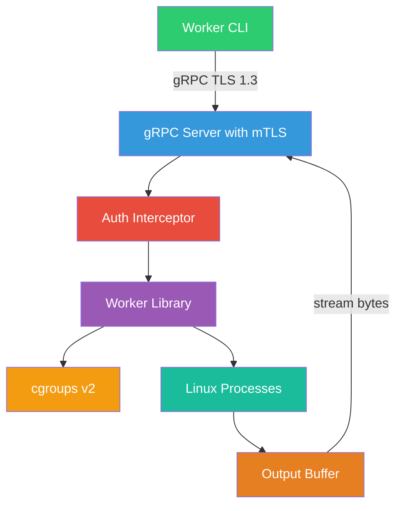
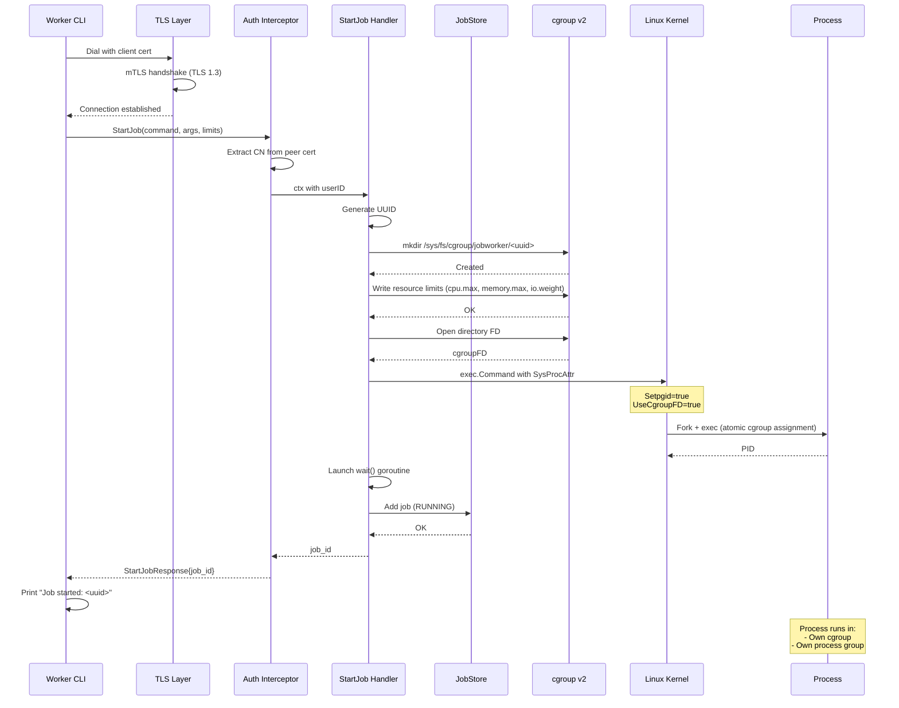
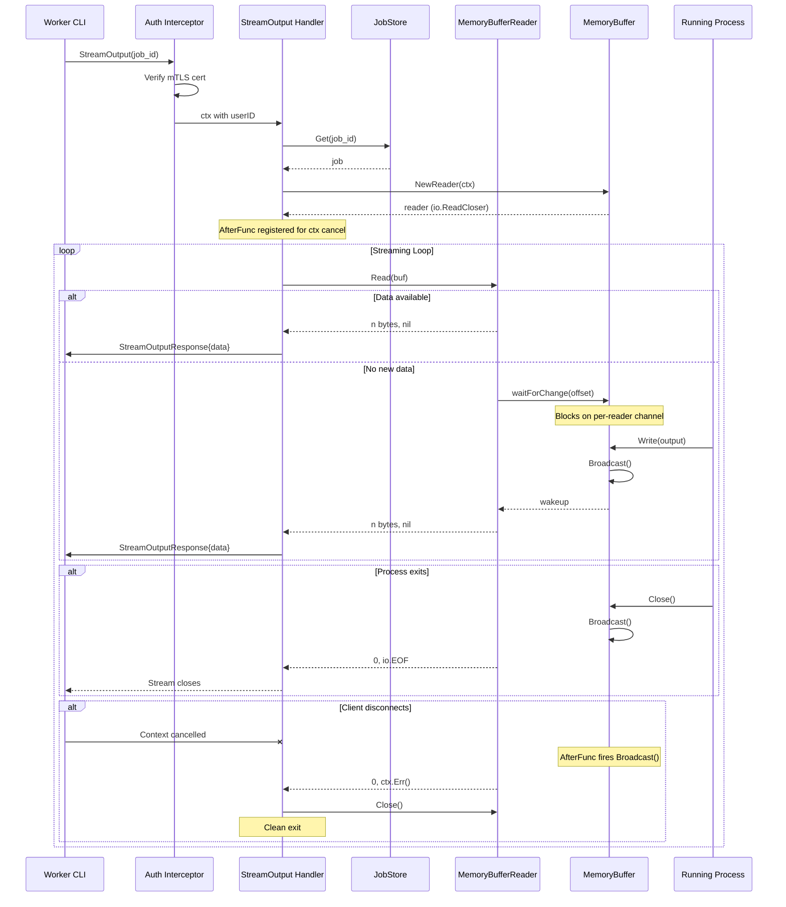
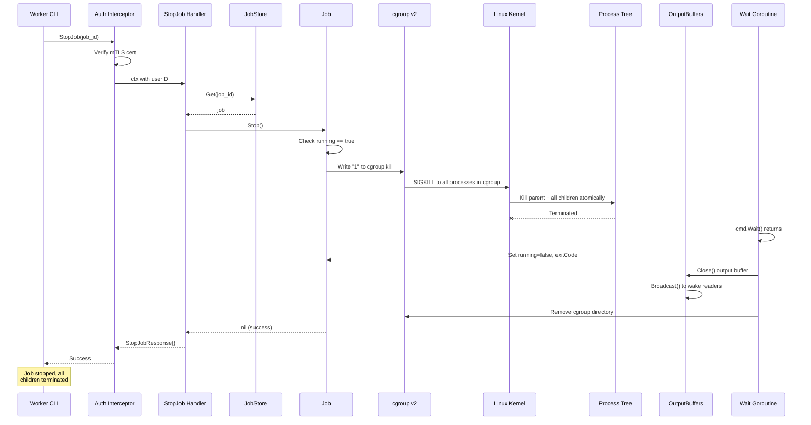
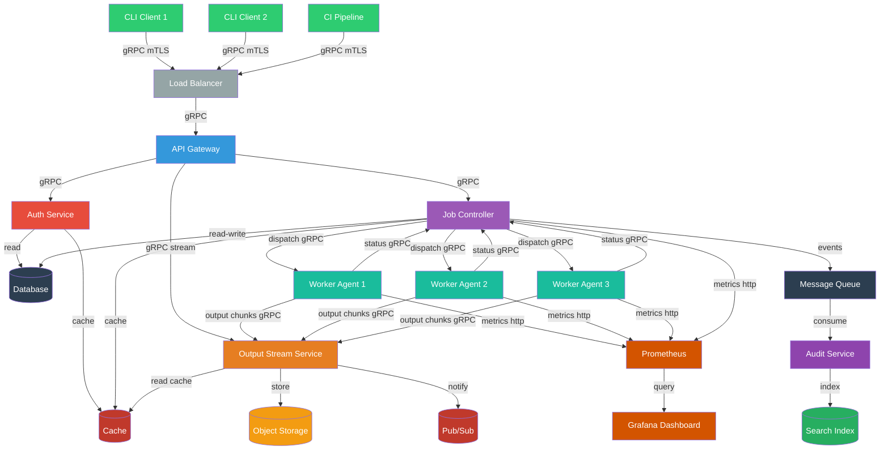

# System Design: Job Worker

## Table of Contents

1. [Objective](#objective)
2. [Functional Requirements](#functional-requirements)
3. [High-Level Architecture](#high-level-architecture)
4. [Architecture Diagram (Prototype)](#architecture-diagram-prototype)
5. [Security](#security)
6. [Authentication & Authorization](#authentication--authorization)
7. [TLS Configuration](#tls-configuration)
8. [Process Management](#process-management)
9. [Cgroup Assignment Patterns](#cgroup-assignment-patterns)
10. [Request-Response Flow Details](#request-response-flow-details)
11. [Design Decisions & Pattern Selection](#design-decisions--pattern-selection)
12. [Implementation Patterns](#implementation-patterns)
13. [Goroutine Lifecycle Management](#goroutine-lifecycle-management)
14. [Data Model & API](#data-model--api)
15. [CLI Interface Design](#cli-interface-design)
16. [Key Areas to Consider](#key-areas-to-consider)
17. [Known Complexity Areas](#known-complexity-areas)
18. [Testing Strategy](#testing-strategy)
19. [Known Limitations & Accepted Tradeoffs](#known-limitations--accepted-tradeoffs)
20. [References](#references)


## Objective

The Job Worker is a secure, Linux-based job execution system that allows authenticated clients to remotely start, stop, monitor, and stream output from arbitrary processes. It uses cgroups v2 for process grouping, resource control (CPU, memory, I/O), and termination. The service uses mTLS for mutual authentication, eliminating password management while providing strong identity verification.

This system addresses the need for a lightweight, self-contained job execution platform where multiple clients can submit and observe long-running tasks without requiring full container orchestration overhead. By embedding the worker library directly in the server, it minimizes operational complexity while maintaining security through certificate-based access control and per-user job authorization.

---

## Functional Requirements

Based on the primary discussion with the team, these are the functional requirements for the MVP:

- **Start arbitrary Linux processes** — Execute any binary with command and arguments. No env vars, stdin, or working directory support.
- **Stop jobs with immediate SIGKILL** — No graceful shutdown. SIGKILL sent via cgroup.kill to entire process tree.
- **Query job status** — Return running, completed, failed, or stopped state for any job.
- **Stream output from byte 0** — Real-time combined stdout/stderr streaming. Late joiners always start from the beginning. Streams are merged to preserve output ordering.
- **Concurrent output streaming** — Multiple clients can stream the same job simultaneously.
- **Binary-safe output** — Raw bytes throughout. No text encoding assumptions.
- **Kill entire process tree** — Use cgroup.kill to terminate parent and all children atomically.
- **Resource limits** — CPU, memory, and disk I/O limits per job via cgroups v2 controllers.
- **mTLS authentication** — TLS 1.3 only, ECDSA P-256 certificates, client cert required.
- **Authorization** — Per-user job isolation. Admin role (OU=admin) can access all jobs.
- **CLI client** — Kingpin-based CLI supporting start, stop, status, and output commands.
- **Output persistence** — Keep job output in memory after completion (best-effort, no disk).

### Explicitly NOT in Scope

- Environment variables — command + args only
- Working directory specification — command + args only
- Graceful SIGTERM → SIGKILL shutdown — immediate SIGKILL
- OOM detection/reporting — uniform failure reporting
- Concurrency limits — no limit on concurrent jobs
- Job persistence across restarts — in-memory only
- Certificate revocation (CRL/OCSP) — out of scope for prototype
- Job listing — not required by challenge
- Custom job names — server assigns UUID, no user-defined names


---

## High-Level Architecture

The system follows a **client-server architecture** with the server embedding
the worker library. The prototype is a monolith — all components in a single
binary.

> **Platform:** The server requires **Linux** with cgroups v2 (kernel 5.7+). The CLI client can run on any platform but must connect to a Linux server.

### Architecture Components

```
Client Layer          Transport Layer          Server Layer              OS Layer
+-------------+      +--------------+      +------------------+      +-------------+
| worker-cli  |----->| gRPC + mTLS  |----->| gRPC Server      |      | Linux       |
| (kingpin)   |      | TLS 1.3      |      |   Auth Intercept |----->| Processes   |
+-------------+      | ECDSA P-256  |      |   RPC Handlers   |      | cgroups v2  |
                      +--------------+      +------------------+      +-------------+
                                                    |
                                            +------------------+
                                            | Worker Library   |
                                            |   JobManager     |
                                            |   OutputBuffer   |
                                            |   CgroupManager  |
                                            +------------------+
```

### Why These Technology Choices

| Component | Choice | Why |
|-----------|--------|-----|
| **Language** | Go | First-class concurrency (goroutines), strong stdlib (crypto/tls, os/exec, syscall), static binary deployment, race detector |
| **Transport** | gRPC | Native streaming support (server-side streaming for output), efficient binary protocol (protobuf), built-in TLS support, code generation |
| **Auth** | mTLS | No password/token management, mutual verification, identity embedded in cert, standard TLS infrastructure |
| **CLI** | Kingpin | Env var support, type-safe flags, subcommand model, recommended in challenge |
| **Process management** | cgroups v2 | Process grouping, resource limits (CPU/memory/IO), and termination; no container overhead |
| **Job IDs** | UUID v4 | No coordination needed, no sequential guessing, globally unique |
| **Output notify** | Per-reader channels | O(1) notification per reader, no thundering herd, clean io.ReadCloser interface |
| **Storage** | In-memory map | Prototype simplicity, no external dependency, sub-millisecond access |

### Implementation Constraints

Per challenge requirements, key components use **Go standard library only**:

| Component | Packages Used | No Third-Party |
|-----------|---------------|----------------|
| **cgroups** | `os`, `syscall`, `golang.org/x/sys/unix` | No libcgroup, cgroupfs-mount |
| **Output streaming** | Per-reader channels, `io` | No streaming libraries, no sync.Cond |
| **Authorization** | `crypto/x509`, `crypto/tls` | No JWT, OAuth libraries |

**Allowed external dependencies:**
- gRPC (`google.golang.org/grpc`) — required for Level 3+ API
- Kingpin (`github.com/alecthomas/kingpin`) — CLI framework (challenge recommendation)
- Protocol Buffers (`google.golang.org/protobuf`) — gRPC serialization

### Happy Path for User Request (Start Job)

1. **User** runs `worker-cli start /usr/bin/python3 script.py`
2. **CLI** loads client TLS cert, dials gRPC server with mTLS
3. **gRPC Server** completes TLS handshake, verifies client cert against CA
4. **Auth Interceptor** extracts CN=`developer1`, OU=`user` from peer cert, attaches to context
5. **RPC Handler** calls `JobManager.Start("python3", ["script.py"])`
6. **JobManager** creates cgroup at `/sys/fs/cgroup/jobworker/<uuid>/`, writes resource limits if specified
7. **JobManager** creates `exec.Command` with `Setpgid=true` and `CgroupFD`
8. **Process starts** in its own process group inside the cgroup (inherits resource limits)
9. **OutputBuffer** begins capturing stdout+stderr via pipe
10. **Wait goroutine** launched to monitor process exit
11. **Job ID** returned through the chain back to CLI
12. **CLI** prints: `Job started: <uuid>`

---

## Architecture Diagram (Prototype)



---

## Security

The security model provides authentication and authorization, not process isolation:

| Layer | Mechanism | Purpose |
|-------|-----------|---------|
| **Transport** | TLS 1.3 with mTLS | Encrypted communication, mutual authentication |
| **Identity** | X.509 certificates | No passwords, identity embedded in cert CN/OU |
| **Process** | cgroups v2 | Process tree grouping and termination |
| **Execution** | `exec.Command` (no shell) | Prevents command injection attacks |

**Security boundaries:**
- Jobs cannot impersonate other clients (mTLS verification)
- Commands are executed directly without shell interpretation

**Out of scope (no process isolation):**
- Cgroups provide process grouping, not containment — processes can move between cgroups if they have permissions
- No namespace isolation (PID, mount, network) — jobs can see and interact with other processes
- No filesystem isolation — jobs have full access to files the server user can access

---

## Authentication & Authorization

### Authentication: mTLS

All clients must present a valid X.509 certificate signed by the trusted CA. The server extracts identity from the certificate:

| Field | Purpose | Example |
|-------|---------|---------|
| **CN (Common Name)** | User identity | `developer1`, `ci-bot` |
| **OU (Organizational Unit)** | Role classification | `user`, `admin` |

**Authentication flow:**
1. Client presents certificate during TLS handshake
2. Server verifies certificate chain against CA
3. Server extracts CN and OU from peer certificate
4. Identity attached to request context for all subsequent operations

**No additional authentication:** Per challenge requirements, mTLS is the only authentication mechanism. No JWT, Bearer tokens, or other auth protocols are layered on top.

### Authorization: Per-User Job Isolation

The authorization model enforces **per-user job isolation** with admin superuser access:

| Principal | Permissions |
|-----------|-------------|
| **Regular user (OU=user)** | Full access to own jobs only. Cannot see or manage other users' jobs. |
| **Admin (OU=admin)** | Full access to all jobs across all users. Can view, stop, and stream any job. |

**Authorization Matrix:**

| Action | Owner | Admin | Other Users |
|--------|-------|-------|-------------|
| Start job | ✓ | ✓ | ✓ |
| View own jobs | ✓ | ✓ | ✓ |
| View others' jobs | ✗ | ✓ | ✗ |
| Stop own jobs | ✓ | ✓ | ✓ |
| Stop others' jobs | ✗ | ✓ | ✗ |
| Stream own output | ✓ | ✓ | ✓ |
| Stream others' output | ✗ | ✓ | ✗ |

**Implementation approach:**
- Job ownership is determined by the `CN` (Common Name) from the client certificate
- Admin status is determined by `OU=admin` in the client certificate
- Unauthorized access returns "job not found" (not "unauthorized") for security — prevents job ID enumeration
- Single map structure: `map[jobID]*Job` with ownership check on access

**Design rationale:** Per-user isolation is the appropriate security boundary for a job execution system. Users should only access their own jobs. The admin superuser capability allows operations teams to manage and debug jobs across all users when needed.

---

## TLS Configuration

### Protocol Requirements

| Setting | Value | Rationale |
|---------|-------|-----------|
| **TLS Version** | 1.3 only | Stronger security, no cipher negotiation needed |
| **Client Auth** | `RequireAndVerifyClientCert` | Mutual authentication required |
| **Key Algorithm** | ECDSA P-256 | Modern, fast, secure |
| **Certificate Validity** | 1 year | Short-lived as mitigation for compromise |

**SSL Labs Rating:** This configuration achieves an **A+** rating:
- TLS 1.3 only (no downgrade attacks)
- ECDSA P-256 keys (modern, fast)
- Forward secrecy via ephemeral key exchange
- No weak cipher suites (TLS 1.3 has no legacy ciphers)

See [Mozilla SSL Configuration Generator](https://ssl-config.mozilla.org/) for recommended settings.

### Certificate Structure

```
CA Certificate (ca.pem)
├── Server Certificate (server.pem)
│   └── CN=worker-server, OU=server
└── Client Certificates
    ├── client1.pem (CN=client1, OU=user)
    └── admin.pem (CN=admin, OU=admin)
```

### Server TLS Configuration

```go
&tls.Config{
    Certificates: []tls.Certificate{serverCert},
    ClientCAs:    caPool,
    ClientAuth:   tls.RequireAndVerifyClientCert,
    MinVersion:   tls.VersionTLS13,
}
```

### Client TLS Configuration

```go
&tls.Config{
    Certificates: []tls.Certificate{clientCert},
    RootCAs:      caPool,
    MinVersion:   tls.VersionTLS13,
}
```

---

## Process Management

> **Note:** This service is **Linux-only**. The cgroups v2 features described below are Linux kernel features that do not exist on macOS or Windows. For development on non-Linux systems, use Docker, a VM, or a remote Linux machine.

Jobs are grouped and managed using Linux kernel primitives. This section details the process management mechanisms. Note that cgroups provide grouping and resource control, not isolation — processes can interact with each other and the host system.

### cgroups v2

Each job runs in its own cgroup under `/sys/fs/cgroup/jobworker/<job-uuid>/`. cgroups provide:

| Feature | Purpose | Implementation |
|---------|---------|----------------|
| **Process grouping** | Track all processes spawned by a job | Atomic assignment via `CgroupFD` at fork |
| **Unified termination** | Kill entire process tree reliably | Write `"1"` to `cgroup.kill` |
| **Resource limits** | Enforce CPU, memory, and I/O limits | Write to controller files (cpu.max, memory.max, io.weight) |

**Atomic cgroup assignment:**
```go
cmd.SysProcAttr = &syscall.SysProcAttr{
    UseCgroupFD: true,
    CgroupFD:    cgroupFD,  // FD to /sys/fs/cgroup/jobworker/<uuid>
}
```

This ensures the process is placed in the cgroup at fork time, before any child processes can spawn outside the cgroup.

### Process Group Setup

Each job runs as a process group leader (`Setpgid: true`):

```go
cmd.SysProcAttr = &syscall.SysProcAttr{
    Setpgid: true,
}
```

**Benefits:**
- Job doesn't share controlling terminal with server process
- Prevents job from receiving signals intended for the server (e.g., Ctrl+C)

**Note:** Process termination uses cgroup.kill exclusively, not PGID signaling. Setpgid is retained for signal separation only.

### Process Termination Strategy

Termination uses cgroup.kill exclusively:

```
cgroup.kill (v2)
└── Write "1" to /sys/fs/cgroup/jobworker/<uuid>/cgroup.kill
└── Kernel sends SIGKILL to ALL processes in cgroup atomically
```

**Why cgroup.kill only (no PGID fallback):**
- Atomic operation — no race conditions with PID reuse
- Catches all processes regardless of process group (handles `setsid()` escapes)
- Works even if main process has exited but children remain
- PGID signaling has inherent races with `waitid()` — the PID could be reused between getting the PGID and sending the signal
- If cgroup.kill fails, there's a fundamental issue (permissions, wrong path) that PGID signaling won't solve

### Resource Limits

Each job can have CPU, memory, and disk I/O limits enforced via cgroups v2 controllers. Limits are written to controller files before the process starts.

| Resource | Controller | File | Format | Example |
|----------|------------|------|--------|---------|
| **CPU** | cpu | `cpu.max` | `$QUOTA $PERIOD` | `50000 100000` (50% of one core) |
| **Memory** | memory | `memory.max` | bytes | `536870912` (512 MiB) |
| **Disk I/O** | io | `io.weight` | `default $WEIGHT` or `$MAJ:$MIN $WEIGHT` | `default 100` (range 1-10000) |

**Implementation:**

```go
func (j *Job) setupResourceLimits() error {
    // CPU limit: 50% of one core = 50000/100000 microseconds
    if j.CPULimit > 0 {
        quota := int(j.CPULimit * 100000)  // CPULimit is fraction (0.5 = 50%)
        err := os.WriteFile(
            filepath.Join(j.cgroupPath, "cpu.max"),
            []byte(fmt.Sprintf("%d 100000", quota)),
            0644,
        )
        if err != nil {
            return fmt.Errorf("failed to set CPU limit: %w", err)
        }
    }

    // Memory limit in bytes
    if j.MemoryLimit > 0 {
        err := os.WriteFile(
            filepath.Join(j.cgroupPath, "memory.max"),
            []byte(strconv.FormatInt(j.MemoryLimit, 10)),
            0644,
        )
        if err != nil {
            return fmt.Errorf("failed to set memory limit: %w", err)
        }
    }

    // I/O weight: relative priority (1-10000, default 100)
    if j.IOWeight > 0 {
        err := os.WriteFile(
            filepath.Join(j.cgroupPath, "io.weight"),
            []byte(fmt.Sprintf("default %d", j.IOWeight)),
            0644,
        )
        if err != nil {
            return fmt.Errorf("failed to set I/O weight: %w", err)
        }
    }

    return nil
}
```

**Limit enforcement timing:**
1. Create cgroup directory
2. Write resource limits to controller files
3. Open cgroup FD
4. Start process with `CgroupFD` (process inherits limits)

**Notes:**
- Limits are optional — if not specified, no limits are enforced (cgroup defaults)
- CPU limit is expressed as a fraction (0.5 = 50% of one CPU core)
- Memory limit is in bytes; OOM killer terminates process if exceeded
- I/O weight is relative (1-10000, default 100); higher weight = higher I/O priority
- All limits apply to the entire process tree (parent + children)

### Filesystem Access

Jobs have **full filesystem access** (prototype limitation):
- Can read/write any file the server user can access
- No chroot or mount namespace isolation
- No read-only root filesystem

### Summary of SysProcAttr Flags

```go
cmd.SysProcAttr = &syscall.SysProcAttr{
    Setpgid:     true,                    // New process group
    UseCgroupFD: true,                    // Atomic cgroup assignment
    CgroupFD:    cgroupFD,                // Cgroup directory FD
}
```

| Flag | Purpose | Effect |
|------|---------|--------|
| `Setpgid` | Signal separation | Job doesn't receive server's signals |
| `UseCgroupFD` | Process grouping | Places process in cgroup at fork for unified termination |

---

## Cgroup Assignment Patterns

This section explains choice of cgroup assignment mechanism and the alternatives considered.

### Approach: CgroupFD (Atomic Assignment at Fork)

Use Go's `UseCgroupFD` with `CgroupFD` (available since Go 1.16) for atomic cgroup assignment:

```go
cmd.SysProcAttr = &syscall.SysProcAttr{
    UseCgroupFD: true,
    CgroupFD:    cgroupFD,  // FD to /sys/fs/cgroup/jobworker/<uuid>
}
```

**How it works:**
1. Before starting the process, open the cgroup directory as a file descriptor
2. Pass the FD via `SysProcAttr.CgroupFD`
3. Kernel places the child process in the cgroup **at fork time**, before any child code executes
4. Close the FD after `cmd.Start()` returns

**Benefits:**
- **No race condition**: Child is in cgroup before its first instruction executes. Children spawned by the job are automatically in the same cgroup.
- **Single binary deployment**: No external helper binaries needed (unlike `cgexec` or `systemd-run`)
- **Direct kernel interface**: Uses clone3() with CLONE_INTO_CGROUP flag internally
- **Go-native**: Works with standard `os/exec` package

### Alternatives Considered and Rejected

| Approach | Description | Why Rejected |
|----------|-------------|--------------|
| **Post-start assignment** | Start process, then write PID to `cgroup.procs` | **Race condition**: Children spawned before assignment escape the cgroup |
| **External helper (`cgexec`)** | Use `cgexec -g cpu:jobworker/<id> /bin/cmd` | Adds external dependency; requires cgexec installed; extra process overhead |
| **systemd-run** | Use `systemd-run --scope ...` | Heavy dependency on systemd; not portable; complex lifecycle management |
| **Wrapper binary** | Custom Go binary that assigns cgroup then execs | Unnecessary complexity; CgroupFD achieves the same result natively |

### The Race Condition Problem

Without atomic assignment, this sequence is vulnerable:

```
1. Parent: fork() → child PID = 1234
2. Parent: write "1234" to /sys/fs/cgroup/jobworker/abc/cgroup.procs
3. BUT: Child has already called fork() creating grandchild PID = 1235
4. Grandchild 1235 is NOT in the cgroup — it escaped!
```

With `CgroupFD`, step 1 atomically places PID 1234 in the cgroup before the child executes any code. Any grandchildren inherit the cgroup.

### Requirements

- **Go version**: 1.16+ (when `UseCgroupFD` was added)
- **Kernel version**: 5.7+ (for clone3 with CLONE_INTO_CGROUP)
- **cgroups version**: v2 (unified hierarchy)

---

## Request-Response Flow Details

### Use Case 1: Start a Job

**Scenario:** A developer starts a build job.



**Step-by-step flow:**

1. **CLI** parses `worker-cli start make build`
2. **CLI** loads `client1.pem` + `client1-key.pem`, dials `localhost:50051` with TLS 1.3
3. **gRPC TLS handshake:** Server verifies client cert against CA. Client verifies server cert.
4. **Auth Interceptor** extracts `CN=developer1, OU=user` from peer certificate. Attaches to `context.Context`.
5. **StartJob handler** generates UUID, validates inputs (command exists at path).
6. **Cgroup setup:**
   - `mkdir /sys/fs/cgroup/jobworker/<uuid>`
   - Write resource limits to controller files (cpu.max, memory.max, io.weight) if specified
   - Open directory FD for `CgroupFD`
7. **exec.Command("make", ["build"])** with `SysProcAttr{Setpgid: true, UseCgroupFD: true, CgroupFD: fd}`
8. **cmd.Start()** — kernel clones process into cgroup and new process group atomically
9. **OutputBuffer** starts receiving stdout+stderr via pipes
10. **Wait goroutine** launched: blocks on `cmd.Wait()`
11. **Job stored** in `JobStore` with `owner: "developer1"`, status `RUNNING`
12. **Response** returns `job_id` to CLI
13. **CLI** prints `Job started: <uuid>`

**Error paths:**
- Command not found → `NOT_FOUND` with message "executable not found: make"
- Cgroup creation fails (not root) → `PERMISSION_DENIED` with message "insufficient privileges for cgroup creation"
- Resource limit write fails → `INTERNAL` with message describing the failure

---

### Use Case 2: Stream Job Output

**Scenario:** A user streams real-time output from a job (any job, per design decision).



**Step-by-step flow:**

1. **CLI** parses `worker-cli output a1b2c3d4-...`
2. **gRPC connection** established with mTLS (same as above)
3. **Auth Interceptor:** Verifies client has valid mTLS cert.
4. **StreamOutput handler** looks up job by ID in `JobStore`.
5. **Authorization check:** User must own the job, or be admin (OU=admin). Returns NOT_FOUND if unauthorized (prevents enumeration).
6. **Handler creates reader** via `NewReader(ctx)` — registers reader with per-reader notification channel.
7. **Streaming loop:**
   ```go
   reader := job.Output.NewReader(stream.Context())
   defer reader.Close()

   buf := make([]byte, 32*1024)
   for {
       n, err := reader.Read(buf)
       if err == io.EOF {
           return nil  // Job finished
       }
       if err != nil {
           return nil  // Context cancelled or reader closed
       }
       stream.Send(&pb.StreamOutputResponse{Data: buf[:n]})
   }
   ```
8. **Client receives** chunks and writes raw bytes to stdout.
9. **When process exits:** OutputBuffer is closed → notification sent → `Read()` returns `io.EOF` → handler exits.
10. **If client disconnects:** Context cancelled → `select` receives from `ctx.Done()` → `Read()` returns `ctx.Err()` → handler exits cleanly.
11. **On reconnect:** Client starts from byte 0 again (always from beginning).

**Error paths:**
- Job not found → `NOT_FOUND`
- Job has no output yet → `Read()` blocks (this is normal, not an error)

**Note:** Per-user isolation enforced — users can only stream their own jobs. Admin (OU=admin) can stream any job. Users interact with standard `io.ReadCloser` interface — notification mechanics are internal.

---

### Use Case 3: Stop a Job with Child Processes

**Scenario:** A CI pipeline job spawned several child processes. User stops it.



**Step-by-step flow:**

1. **CLI** parses `worker-cli stop a1b2c3d4-...`
2. **gRPC + mTLS** as above. `CN=ci-bot, OU=user`.
3. **Auth check:** User must own the job, or be admin (OU=admin). Returns NOT_FOUND if unauthorized.
4. **StopJob handler** looks up job in `JobStore`.
5. **Job.Stop():**
   - Verify status == RUNNING.
   - Write `"1"` to `/sys/fs/cgroup/jobworker/<uuid>/cgroup.kill`
   - If cgroup.kill fails, return error (no fallback — indicates a fundamental issue)
6. **Kernel kills entire process tree** atomically — parent AND all children (make, gcc, ld, etc.).
   **No graceful SIGTERM period** — immediate termination per design decision.
7. **Wait goroutine** unblocks from `cmd.Wait()`, sets status to `STOPPED`.
8. **OutputBuffer.Close()** — broadcasts to wake all streaming readers, they exit cleanly.
9. **Cgroup cleanup:**
   - `os.Remove("/sys/fs/cgroup/jobworker/<uuid>")` — succeeds because all processes are dead.
10. **Response** returns empty `StopJobResponse` (success).

**Error paths:**
- Job not found → `NOT_FOUND`
- Job already stopped/completed → Return success (idempotent)
- cgroup.kill fails → Return `INTERNAL` error (indicates permissions or path issue)

**Note:** Per-user isolation enforced — users can only stop their own jobs. Admin (OU=admin) can stop any job. cgroup.kill is the only termination mechanism — it atomically kills the entire process tree with a single write.

---

### Use Case 4: Job Fails (Generic)

**Scenario:** A job exits with a non-zero exit code or is killed by a signal.

```
Process exits/killed → cmd.Wait() returns → report FAILED with exit code
```

1. **Job is running** (with optional resource limits if specified at start).
2. **Process exits** with non-zero code, or is killed by a signal.
3. **cmd.Wait() returns** with exit status.
4. **Wait goroutine detects non-zero exit:**
   ```go
   if exitErr, ok := err.(*exec.ExitError); ok {
       status = FAILED
       exitCode = exitErr.ExitCode()
   }
   ```
5. **Set job status:**
   - Status: `FAILED`
   - ExitCode: process exit code (e.g., 137 for SIGKILL, 1 for generic error)
   - Error: generic failure message (no OOM-specific detection)
6. **OutputBuffer.Close()** — streaming clients receive final output + EOF.
7. **Cgroup cleanup** proceeds normally.
8. **Client polling status sees:**
   ```
   Job ID:  a1b2c3d4-...
   Status:  FAILED
   Exit:    <exit_code>
   ```

**Note:** After preliminary discussion with team, we do NOT distinguish OOM kills from other failures. All failures are reported uniformly with the exit code.

---

## Design Decisions & Pattern Selection

Each component pattern is evaluated against specific requirements and simplified
where constraints allow. This solution prioritizes **simplicity** and **correctness** over
over-engineering.


### Design Rationale

1. **Per-user job isolation** — Users should only access and manage their own jobs. This is
   the appropriate security boundary for a multi-tenant job execution system. Admin users
   (OU=admin) can access all jobs for operational purposes.

2. **Simple job storage** — Single `map[jobID]*Job` with ownership check on access.
   Since job listing is out of scope, per-user lookup efficiency is not a concern.

3. **Concrete types, no interfaces** — Use concrete types throughout. No interface-based
   abstractions for testing. Testing happens at system boundaries with real components.

4. **cgroups v2** — The unified hierarchy is simpler, supports `cgroup.kill` for
   reliable process tree termination, and provides resource controllers (cpu, memory, io)
   for enforcing per-job limits.

5. **Hybrid resource limits** — CPU and memory use hard limits (`cpu.max`, `memory.max`)
   for predictable resource boundaries and fail-fast behavior. I/O uses relative weights
   (`io.weight`) for fair sharing without requiring device-specific configuration. This
   balances predictability where it matters (CPU/memory) with simplicity where it doesn't (I/O).

### Critical Implementation Details

1. **Cgroup Race Condition**: Process must be placed in cgroup **atomically at fork**,
   not after start. If we start the process then assign to cgroup, children spawned
   before assignment won't be in the cgroup. Solution: `UseCgroupFD: true` with
   cgroup directory FD ensures atomic placement.

2. **Output Streaming Synchronization**: Per-reader channels notify waiting readers on
   write/close. Each reader has its own channel, eliminating thundering herd. Users interact via `io.ReadCloser` interface.

3. **Stream Cleanup**: Reader's `Close()` method sends a notification to unblock any
   pending `Read()` calls. Context cancellation is handled via select in the read loop.
   No watcher goroutines or `context.AfterFunc` callbacks needed.

---

## Implementation Patterns

These patterns are **optimized for existing requirements**. Key features:
simple job store with ownership check, resource limits via cgroup controllers, cgroup.kill for termination.

### Job Store with Ownership Check

The job store uses a simple map structure with ownership verification on access.

```go
type JobStore struct {
    mu      sync.Mutex
    jobs    map[string]*Job  // jobID -> Job
}

func (s *JobStore) Add(job *Job) {
    s.mu.Lock()
    defer s.mu.Unlock()
    s.jobs[job.ID] = job
}

func (s *JobStore) Get(userID, jobID string, isAdmin bool) (*Job, error) {
    s.mu.Lock()
    defer s.mu.Unlock()
    job, ok := s.jobs[jobID]
    if !ok {
        return nil, ErrJobNotFound
    }
    // Ownership check: user must own the job, or be admin
    if !isAdmin && job.Owner != userID {
        return nil, ErrJobNotFound  // No information leak
    }
    return job, nil
}
```

**Design notes:**
- Unauthorized access returns `ErrJobNotFound` (not `ErrUnauthorized`) to prevent job ID enumeration
- Admin status is determined by `OU=admin` in the client certificate
- No List operation — clients must know the job ID to query

### Job Struct (Concrete Type)

Use a concrete struct. Testing happens at system boundaries with real gRPC servers
and real processes — no internal abstractions.

```go
type Job struct {
    ID           string
    Owner        string
    Command      string
    Args         []string

    // Resource limits (optional, 0 = unlimited)
    CPULimit          float64  // Fraction of one CPU core (0.5 = 50%)
    MemoryLimit       int64    // Bytes
    IOWeight           int32   // I/O weight (1-10000, default 100)

    mu           sync.Mutex
    running      bool
    exitCode     int
    signalNum    syscall.Signal
    pid          int
    cgroupPath   string

    cmd          *exec.Cmd
    outputBuffer *MemoryBuffer  // Combined stdout+stderr, preserves ordering
}
```

### Process Creation with CgroupFD

Atomic cgroup assignment at fork time prevents the race condition where children
spawn before cgroup assignment.

```go
func (j *Job) Start() error {
    j.mu.Lock()
    defer j.mu.Unlock()
    // ... check if already running

    // Create cgroup and open FD for atomic assignment
    j.cgroupPath = filepath.Join("/sys/fs/cgroup/jobworker", j.ID)
    os.MkdirAll(j.cgroupPath, 0755)

    // Write resource limits before opening FD (process inherits limits)
    if err := j.setupResourceLimits(); err != nil {
        return err
    }

    // O_CLOEXEC prevents FD leak into child process after exec (CVE-2024-21626)
    cgroupFD, _ := unix.Open(j.cgroupPath, unix.O_DIRECTORY|unix.O_RDONLY|unix.O_CLOEXEC, 0)
    defer unix.Close(cgroupFD)

    j.cmd = exec.Command(j.Command, j.Args...)
    j.cmd.SysProcAttr = &syscall.SysProcAttr{
        Setpgid:     true,                     // New process group
        UseCgroupFD: true, CgroupFD: cgroupFD, // Atomic cgroup assignment
    }
    // ... setup combined output buffer (cmd.Stdout = cmd.Stderr = outputBuffer)

    j.cmd.Start()
    go j.wait()  // Monitors exit, closes buffers, cleans up cgroup
    return nil
}
```

### Process Termination with cgroup.kill

cgroups v2 provides `cgroup.kill` which atomically terminates the entire process tree
with a single write. No PGID fallback — if cgroup.kill fails, it indicates a fundamental
issue (permissions, wrong path) that should be surfaced as an error.

```go
func (j *Job) Stop() error {
    j.mu.Lock()
    defer j.mu.Unlock()

    if !j.running {
        return nil  // Already stopped (idempotent)
    }

    // cgroup.kill terminates entire tree atomically
    killPath := filepath.Join(j.cgroupPath, "cgroup.kill")
    if err := os.WriteFile(killPath, []byte("1"), 0644); err != nil {
        return fmt.Errorf("failed to kill cgroup %s: %w", j.cgroupPath, err)
    }

    return nil
}
```

### MemoryBuffer with Per-Reader Channels

This pattern uses per-reader notification channels instead of `sync.Cond`. Each reader
has its own buffered channel, eliminating the thundering herd problem and providing
a clean `io.ReadCloser` interface.

**Design evolution:** Earlier iterations used `sync.Cond` with `context.AfterFunc` for
cancellation. This was replaced with per-reader channels to address several issues
(see [Design Evolution](#design-evolution-streaming-api) below).

```go
type MemoryBuffer struct {
    mu        sync.Mutex
    content   []byte
    closed    bool
    closeOnce sync.Once
    readers   map[*MemoryBufferReader]chan struct{}  // Per-reader notification
}

func NewMemoryBuffer() *MemoryBuffer {
    return &MemoryBuffer{
        content: make([]byte, 0, 4096),
        readers: make(map[*MemoryBufferReader]chan struct{}),
    }
}

func (mb *MemoryBuffer) Write(p []byte) (int, error) {
    mb.mu.Lock()
    if mb.closed {
        mb.mu.Unlock()
        return 0, io.ErrClosedPipe
    }
    mb.content = append(mb.content, p...)

    // Copy channels to notify (release lock before sending)
    toNotify := make([]chan struct{}, 0, len(mb.readers))
    for _, ch := range mb.readers {
        toNotify = append(toNotify, ch)
    }
    mb.mu.Unlock()

    // Notify without holding lock (reduces contention)
    for _, ch := range toNotify {
        select {
        case ch <- struct{}{}:
        default: // Already has pending notification
        }
    }
    return len(p), nil
}

func (mb *MemoryBuffer) Close() error {
    mb.closeOnce.Do(func() {
        mb.mu.Lock()
        mb.closed = true
        toNotify := make([]chan struct{}, 0, len(mb.readers))
        for _, ch := range mb.readers {
            toNotify = append(toNotify, ch)
        }
        mb.mu.Unlock()

        for _, ch := range toNotify {
            select {
            case ch <- struct{}{}:
            default:
            }
        }
    })
    return nil
}

// NewReader creates an io.ReadCloser that streams from the buffer.
func (mb *MemoryBuffer) NewReader(ctx context.Context) *MemoryBufferReader {
    r := &MemoryBufferReader{buf: mb, ctx: ctx}
    r.notify = mb.register(r)
    return r
}

type MemoryBufferReader struct {
    buf    *MemoryBuffer
    ctx    context.Context
    notify chan struct{}  // Per-reader notification channel

    mu     sync.Mutex
    offset int64
    closed bool
}

func (r *MemoryBufferReader) Read(p []byte) (int, error) {
    for {
        r.mu.Lock()
        if r.closed {
            r.mu.Unlock()
            return 0, ErrReaderClosed
        }
        currentOffset := r.offset
        r.mu.Unlock()

        if r.ctx.Err() != nil {
            return 0, r.ctx.Err()
        }

        n, _ := r.buf.readAt(p, currentOffset)
        if n > 0 {
            r.mu.Lock()
            r.offset += int64(n)
            r.mu.Unlock()
            return n, nil
        }

        if r.buf.IsClosed() && currentOffset >= r.buf.Size() {
            return 0, io.EOF
        }

        // Wait on per-reader channel OR context cancellation
        select {
        case <-r.notify:
        case <-r.ctx.Done():
            return 0, r.ctx.Err()
        }
    }
}

func (r *MemoryBufferReader) Close() error {
    r.mu.Lock()
    if r.closed {
        r.mu.Unlock()
        return nil
    }
    r.closed = true
    r.mu.Unlock()

    r.buf.unregister(r)

    // Unblock any waiting Read()
    select {
    case r.notify <- struct{}{}:
    default:
    }
    return nil
}
```

**Why per-reader channels:**

| Aspect | Benefit |
|--------|---------|
| Per-reader channel | No thundering herd — only the relevant reader wakes |
| `select` with `ctx.Done()` | Native context cancellation — no `context.AfterFunc` needed |
| `Close()` sends notification | Reader unblocks immediately — no dependency on context cancel |
| Lock released before notify | Reduced contention under high write throughput |

### gRPC Streaming with io.ReadCloser

The gRPC handler uses the `io.ReadCloser` interface provided by `MemoryBufferReader`.
Context cancellation and reader close both work independently — no ordering requirements.

```go
func (s *Server) StreamOutput(req *pb.StreamOutputRequest, stream pb.Worker_StreamOutputServer) error {
    job, err := s.store.Get(userID, req.JobId, isAdmin)
    if err != nil {
        return status.Error(codes.NotFound, "job not found")
    }

    reader := job.Output.NewReader(stream.Context())
    defer reader.Close()

    buf := make([]byte, 32*1024)
    for {
        n, err := reader.Read(buf)
        if err == io.EOF {
            return nil  // Job finished, all output sent
        }
        if err != nil {
            return nil  // Context cancelled or reader closed
        }
        if err := stream.Send(&pb.StreamOutputResponse{Data: buf[:n]}); err != nil {
            return nil  // Client disconnected
        }
    }
}
```

**Termination lifecycle is straightforward:**
- `defer reader.Close()` handles cleanup automatically
- `Close()` can be called before, after, or without context cancellation
- No deadlock scenarios — all termination paths work independently

**Multiple concurrent clients:** Each `NewReader()` call creates a reader with its own
offset and notification channel. When the process writes output, each reader receives
a notification on its own channel. Late joiners start at offset 0 and replay the full
output. No coordination needed between clients.

### gRPC Auth Interceptor

Extracts client identity from mTLS certificate, including userID (CN) and admin status
(OU=admin). This enables per-user job isolation with admin superuser access.

```go
type ClientIdentity struct {
    UserID  string  // From CN (Common Name)
    IsAdmin bool    // True if OU contains "admin"
}

func UnaryAuthInterceptor(ctx context.Context, req interface{}, info *grpc.UnaryServerInfo, handler grpc.UnaryHandler) (interface{}, error) {
    identity, err := extractIdentityFromCert(ctx)
    // ... return Unauthenticated if err
    ctx = context.WithValue(ctx, identityKey, identity)
    return handler(ctx, req)  // mapToGRPCError converts internal errors to gRPC status codes
}

func extractIdentityFromCert(ctx context.Context) (*ClientIdentity, error) {
    p, _ := peer.FromContext(ctx)
    tlsInfo := p.AuthInfo.(credentials.TLSInfo)
    // ... validate peer and TLS info

    cert := tlsInfo.State.PeerCertificates[0]
    userID := cert.Subject.CommonName
    isAdmin := slices.Contains(cert.Subject.OrganizationalUnit, "admin")

    return &ClientIdentity{UserID: userID, IsAdmin: isAdmin}, nil
}

// mapToGRPCError converts internal errors to gRPC status codes:
// ErrJobNotFound → NotFound, ErrJobExists → AlreadyExists, ErrInvalidJobID → InvalidArgument
```

### TLS 1.3 Configuration

```go
func serverTLSConfig(certFile, keyFile, caFile string) (*tls.Config, error) {
    cert, _ := tls.LoadX509KeyPair(certFile, keyFile)
    caPool := x509.NewCertPool()
    // ... load CA cert from caFile

    return &tls.Config{
        Certificates: []tls.Certificate{cert},
        ClientCAs:    caPool,
        ClientAuth:   tls.RequireAndVerifyClientCert,
        MinVersion:   tls.VersionTLS13,
    }, nil
}
```

---

## Goroutine Lifecycle Management

This section documents the goroutine patterns in the system and how they are managed
to prevent leaks.

### Goroutine Types

| Goroutine | Purpose | Lifetime | Termination Trigger |
|-----------|---------|----------|---------------------|
| **Wait goroutine** | Monitors process exit via `cmd.Wait()` | Job lifetime | Process exits (any reason) |
| **gRPC streaming handler** | Sends output to connected client | Client connection | `Read()` returns EOF or error |
| **Server listener** | Accepts new gRPC connections | Server lifetime | Server shutdown |

**Note:** No watcher goroutines per stream. Context cancellation is handled natively via
`select` on `ctx.Done()` in the reader's Read loop — no callbacks needed.

### Wait Goroutine Lifecycle

Each job spawns exactly one wait goroutine that:

1. Blocks on `cmd.Wait()` until the process exits
2. Updates job state (running → completed/failed/stopped)
3. Closes output buffers (waking all streaming readers)
4. Cleans up the cgroup directory

```go
// Launched in Job.Start()
go j.wait()

func (j *Job) wait() {
    err := j.cmd.Wait()  // Blocks until process exits
    // ... update state, close buffers, cleanup cgroup
}
```

**Termination guarantee:** The goroutine always exits when the process exits. There is
no timeout or cancellation — the process exit is the only termination condition.

### Streaming Handler Lifecycle

The gRPC streaming handler runs in the gRPC server's goroutine pool. It uses an
`io.ReadCloser` from the buffer, with no additional goroutines spawned. It exits when:

1. **Buffer closes** → `Read()` returns `io.EOF`
2. **Context cancelled** → `Read()` returns `ctx.Err()`
3. **Send fails** → `stream.Send()` returns error

```go
reader := job.Output.NewReader(stream.Context())
defer reader.Close()

buf := make([]byte, 32*1024)
for {
    n, err := reader.Read(buf)
    if err == io.EOF {
        return nil  // Job finished
    }
    if err != nil {
        return nil  // Context cancelled or reader closed
    }
    if err := stream.Send(&pb.StreamOutputResponse{Data: buf[:n]}); err != nil {
        return nil  // Send failed
    }
}
```

**No watcher goroutines:** Context cancellation is handled natively via `select` on
`ctx.Done()` inside the reader's Read loop. No callbacks or persistent goroutines needed.

### Why This Pattern

**Why per-reader channels (not sync.Cond)?**
- No thundering herd: each reader has its own channel, only wakes when relevant
- Native context support: `select` with `ctx.Done()` — no `context.AfterFunc` callback needed
- Clean Close(): reader can be closed directly without requiring context cancellation first
- Reduced lock contention: lock released before sending notifications

**Why io.ReadCloser interface?**
- Standard Go interface — works with `io.Copy`, `bufio.Scanner`, etc.
- Natural "close when done" semantics
- Hides notification mechanics from users

### Goroutine Leak Detection

For testing, the following patterns help detect goroutine leaks:

```go
// In tests
func TestNoGoroutineLeak(t *testing.T) {
    before := runtime.NumGoroutine()

    // Run test operations...

    // Wait for cleanup
    time.Sleep(100 * time.Millisecond)

    after := runtime.NumGoroutine()
    if after > before {
        t.Errorf("goroutine leak: %d before, %d after", before, after)
    }
}
```

Use `runtime.Stack()` to dump goroutine stacks when debugging leaks.

---

## Data Model & API

### In-Memory Job Store (Prototype)

For the prototype, job state is stored in-memory using a simple map with ownership
check on access:

```go
// JobStore manages jobs with ownership check on access
type JobStore struct {
    mu    sync.Mutex
    jobs  map[string]*Job  // jobID -> Job
}

type Job struct {
    ID           string
    Owner        string
    Command      string
    Args         []string

    // Resource limits (optional, 0 = unlimited)
    CPULimit          float64  // Fraction of one CPU core (0.5 = 50%)
    MemoryLimit       int64    // Bytes
    IOWeight           int32   // I/O weight (1-10000, default 100)

    mu           sync.Mutex
    running      bool
    exitCode     int
    signalNum    syscall.Signal
    pid          int
    cgroupPath   string

    cmd          *exec.Cmd
    outputBuffer *MemoryBuffer  // Combined stdout+stderr, preserves ordering
}
```

**Why simple map structure:**
- No list operation → no need for efficient per-user enumeration
- Ownership check on Get() → users can only access their own jobs
- Admin check on Get() → admins can access any job
- Single map → minimal memory overhead

### Output Buffer

The `MemoryBuffer` uses per-reader notification channels for efficient wakeup
of waiting readers. Users interact via `io.ReadCloser` interface, with context
cancellation handled natively via `select`:

```go
type MemoryBuffer struct {
    mu        sync.Mutex
    content   []byte
    closed    bool
    closeOnce sync.Once
    readers   map[*MemoryBufferReader]chan struct{}  // Per-reader notification
}

// Write appends content and notifies all registered readers
func (mb *MemoryBuffer) Write(p []byte) (int, error)

// Close marks buffer as closed and notifies all readers
func (mb *MemoryBuffer) Close() error

// NewReader returns an io.ReadCloser that blocks until data is available.
// Respects context cancellation — Read() returns ctx.Err() when cancelled.
func (mb *MemoryBuffer) NewReader(ctx context.Context) *MemoryBufferReader
```

**User-facing interface:**

| Method | Behavior |
|--------|----------|
| `NewReader(ctx)` | Creates reader that starts from byte 0, respects context |
| `Read(p)` | Blocks until data available, returns `io.EOF` when buffer closes |
| `Close()` | Unregisters from buffer, unblocks pending Read() |

**Internal methods (not exposed to users):**

| Method | Purpose |
|--------|---------|
| `readAt(p, offset)` | Random access read (used internally by reader) |
| `register(r)` | Adds reader to notification map, returns channel |
| `unregister(r)` | Removes reader from notification map |

### gRPC API

```protobuf
service WorkerService {
  rpc StartJob(StartJobRequest) returns (StartJobResponse);
  rpc StopJob(StopJobRequest) returns (StopJobResponse);
  rpc GetJobStatus(GetJobStatusRequest) returns (GetJobStatusResponse);
  rpc StreamOutput(StreamOutputRequest) returns (stream StreamOutputResponse);
}

message StartJobRequest {
  string command = 1;
  repeated string args = 2;
  // Resource limits (optional, 0 = unlimited/default)
  double cpu_limit = 3;           // Fraction of one CPU core (0.5 = 50%)
  int64 memory_limit_bytes = 4;   // Memory limit in bytes
  int32 io_weight = 5;            // I/O weight (1-10000, default 100)
}

message StartJobResponse {
  string job_id = 1;
}

enum JobStatus { RUNNING = 0; COMPLETED = 1; FAILED = 2; STOPPED = 3; }
```

**Notes:**
- stdout and stderr are combined into a single stream to preserve output ordering
- Resource limits are optional; 0 or unset means unlimited
- CPU limit of 0.5 means 50% of one core; 2.0 means 200% (two full cores)

### CLI Interface Design

#### Server Binary: `worker-server`

```bash
# Start the server (requires root for cgroups)
sudo worker-server

# With explicit options
sudo worker-server \
  --listen=0.0.0.0:50051 \
  --cert=certs/server.pem \
  --key=certs/server-key.pem \
  --ca=certs/ca.pem \
  --cgroup-root=/sys/fs/cgroup/jobworker
```

**Server Options:**

| Flag | Default | Description |
|------|---------|-------------|
| `--listen` | `0.0.0.0:50051` | Address and port to listen on |
| `--cert` | `./certs/server.pem` | Server TLS certificate |
| `--key` | `./certs/server-key.pem` | Server TLS private key |
| `--ca` | `./certs/ca.pem` | CA certificate for client verification |
| `--cgroup-root` | `/sys/fs/cgroup/jobworker` | Base path for job cgroups |

**Environment Variables:**

| Variable | Equivalent Flag |
|----------|-----------------|
| `WORKER_LISTEN` | `--listen` |
| `WORKER_CERT` | `--cert` |
| `WORKER_KEY` | `--key` |
| `WORKER_CA` | `--ca` |

---

#### Client Binary: `worker-cli`

**Global Flags (apply to all commands):**

| Flag | Default | Description |
|------|---------|-------------|
| `--server` | `localhost:50051` | Server address |
| `--cert` | `./certs/client1.pem` | Client TLS certificate |
| `--key` | `./certs/client1-key.pem` | Client TLS private key |
| `--ca` | `./certs/ca.pem` | CA certificate for server verification |

**Environment Variables:**

| Variable | Equivalent Flag |
|----------|-----------------|
| `WORKER_SERVER` | `--server` |
| `WORKER_CERT` | `--cert` |
| `WORKER_KEY` | `--key` |
| `WORKER_CA` | `--ca` |

---

#### Command: `start` — Start a new job

```bash
worker-cli start [flags] <command> [args...]
```

**Flags:**

| Flag | Default | Description |
|------|---------|-------------|
| `--cpu` | `0` | CPU limit as fraction (0.5 = 50% of one core, 2.0 = two cores) |
| `--memory` | `0` | Memory limit (e.g., `512M`, `1G`, `1073741824`) |
| `--io-weight` | `0` | I/O weight (1-10000, 0 = default 100) |

**Examples:**

```bash
# Start a simple command (no limits)
worker-cli start make

# Start with CPU limit (50% of one core)
worker-cli start --cpu 0.5 make -j4

# Start with memory limit (512 MiB)
worker-cli start --memory 512M python3 train.py

# Start with all limits (high I/O priority)
worker-cli start --cpu 1.0 --memory 1G --io-weight 500 ./heavy-task.sh

# Start with arguments
worker-cli start pytest tests/ -v

# With explicit server address
worker-cli --server worker.example.com:50051 start ./deploy.sh
```

**Output:**

```
Job started: a1b2c3d4-e5f6-7890-abcd-ef1234567890
```

---

#### Command: `stop` — Stop a running job

```bash
worker-cli stop <job-id>
```

**Examples:**

```bash
# Stop by job ID
worker-cli stop a1b2c3d4-e5f6-7890-abcd-ef1234567890

# Stop with short ID (if unique)
worker-cli stop a1b2c3d4
```

**Output:**

```
Job stopped: a1b2c3d4-e5f6-7890-abcd-ef1234567890
```

---

#### Command: `status` — Get job status

```bash
worker-cli status <job-id>
```

**Examples:**

```bash
# Get status of a specific job
worker-cli status a1b2c3d4-e5f6-7890-abcd-ef1234567890
```

**Output (running):**

```
Job ID:    a1b2c3d4-e5f6-7890-abcd-ef1234567890
Owner:     developer1
Status:    RUNNING
PID:       12345
```

**Output (completed):**

```
Job ID:    a1b2c3d4-e5f6-7890-abcd-ef1234567890
Owner:     developer1
Status:    COMPLETED
Exit Code: 0
```

**Output (failed):**

```
Job ID:    a1b2c3d4-e5f6-7890-abcd-ef1234567890
Owner:     developer1
Status:    FAILED
Exit Code: 1
```

**Output (stopped):**

```
Job ID:    a1b2c3d4-e5f6-7890-abcd-ef1234567890
Owner:     developer1
Status:    STOPPED
Signal:    9 (SIGKILL)
```

---

#### Command: `logs` — Stream job output

```bash
worker-cli logs [flags] <job-id>
```

**Flags:**

| Flag | Default | Description |
|------|---------|-------------|
| `--follow`, `-f` | `true` | Follow output (stream in real-time) |
| `--no-follow` | `false` | Print current output and exit |

**Examples:**

```bash
# Stream output (default, follows in real-time)
worker-cli logs a1b2c3d4-e5f6-7890-abcd-ef1234567890

# Print current output and exit (don't follow)
worker-cli logs --no-follow a1b2c3d4

# Short form
worker-cli logs -f a1b2c3d4
```

**Behavior:**
- stdout and stderr are combined into a single stream (preserves ordering)
- Always starts from byte 0 (full replay)
- Streams in real-time until job completes or user presses Ctrl+C
- Raw bytes are written to terminal (supports binary output)
- On disconnect/reconnect, starts from byte 0 again

---

### CLI Usage Summary

```
worker-cli - Job Worker Client

USAGE:
  worker-cli [global flags] <command> [command flags] [arguments]

GLOBAL FLAGS:
  --server    Server address (default: localhost:50051)
  --cert      Client certificate path (default: ./certs/client1.pem)
  --key       Client key path (default: ./certs/client1-key.pem)
  --ca        CA certificate path (default: ./certs/ca.pem)
  --help      Show help

COMMANDS:
  start       Start a new job
  stop        Stop a running job
  status      Get status of a job
  logs        Stream job output
  version     Show version information

EXAMPLES:
  # Start a build job
  worker-cli start make -j4

  # Watch build output
  worker-cli logs <job-id>

  # Stop the build
  worker-cli stop <job-id>

  # Get job status
  worker-cli status <job-id>
```

---

## Key Areas to Consider

### Design Principles

| Area | Decision |
|------|----------|
| **CLI** | Kingpin with sensible defaults, tab completion, gRPC status → human-readable errors |
| **Architecture** | Server embeds worker library directly. Single static Go binary, no runtime deps. |
| **API** | Protobuf `worker.v1` for type safety. Breaking changes caught at compile time. |
| **Latency targets** | Job start < 200ms, status < 50ms, stream first byte < 100ms |

### Prototype Constraints

| Constraint | Implication |
|------------|-------------|
| **Storage** | In-memory only — all state lost on restart |
| **Concurrency** | goroutines + per-reader channels + sync.Mutex for job store |
| **Leak prevention** | `select` on `ctx.Done()` handles cancel. `reader.Close()` unregisters from buffer. |
| **Data races** | Go race detector (`-race`) in CI. Mutex-protected shared state. |

### Security Model

| Aspect | Approach |
|--------|----------|
| **Authentication** | mTLS with X.509 certificates — no passwords |
| **Authorization** | Per-user isolation. Admin via OU=admin. "Job not found" masks unauthorized access. |
| **Encryption** | TLS 1.3 in transit. In-memory only (no at-rest needed). |

### Edge Cases

| Scenario | Behavior |
|----------|----------|
| **Server crash** | Jobs orphaned, metadata/output lost, cgroup cleanup handles processes |
| **Client disconnect** | Context cancelled, clean exit, reconnect starts from byte 0 |
| **Resource exhaustion** | Jobs respect CPU/memory/IO limits if specified; OOM killer terminates jobs exceeding memory |

---

## Known Complexity Areas

This section documents areas of the implementation that require careful attention due to
subtle interactions or non-obvious behavior.

### Per-Reader Channel Notification

The buffer uses per-reader notification channels. Each reader has its own buffered channel
that receives notifications when data is written or the buffer is closed.

```go
// In Read — wait for data or context cancellation
select {
case <-r.notify:        // New data or buffer closed
case <-r.ctx.Done():    // Context cancelled
    return 0, r.ctx.Err()
}
```

**How it works:**
- `Write()` sends to each reader's channel → only that reader wakes
- `Buffer.Close()` sends to all reader channels → readers return `io.EOF`
- `Reader.Close()` sends to its own channel → unblocks pending `Read()`
- Context cancel → `select` receives from `ctx.Done()` → returns `ctx.Err()`

**Why per-reader channels (not sync.Cond):**
- No thundering herd: `sync.Cond.Broadcast()` wakes all readers even if only one has new data
- Native context support: `select` with `ctx.Done()` — no `context.AfterFunc` callback needed
- Clean `Close()`: Reader can be closed directly without requiring context cancellation first

### Cgroup Directory Removal Timing

The cgroup directory can only be removed when all processes in the cgroup have exited.

**The challenge:**
```go
// This may fail if processes are still running
os.Remove(j.cgroupPath)
```

**solution:** Remove the cgroup in the wait goroutine AFTER `cmd.Wait()` returns:
```go
func (j *Job) wait() {
    err := j.cmd.Wait()  // Blocks until process (and all children) exit
    // ... update state, close buffers
    os.Remove(j.cgroupPath)  // Safe now — all processes are dead
}
```

**Pitfall to avoid:** Don't try to remove the cgroup directory in `Stop()` — use
`cgroup.kill` to terminate processes, but let the wait goroutine handle cleanup.

### Why cgroup.kill Only (No PGID Fallback)

Termination uses cgroup.kill exclusively. PGID signaling is intentionally avoided.

**The interaction:**
1. `cgroup.kill` sends SIGKILL to all processes in the cgroup atomically
2. Processes receive SIGKILL and begin termination
3. `cmd.Wait()` in the wait goroutine unblocks
4. Wait goroutine closes buffers and removes cgroup

**Why no PGID fallback:**
- PGID signaling has inherent races with `waitid()` — the PID could be reused between getting the PGID and sending the signal
- cgroup.kill catches all processes regardless of process group (handles `setsid()` escapes)
- If cgroup.kill fails, there's a fundamental issue (permissions, wrong path) that PGID signaling won't solve

**Pitfall to avoid:** Don't add PGID signaling "just in case" — it introduces race conditions without providing meaningful fallback capability.

### Streaming Handler Exit Conditions

Four conditions cause `MemoryBufferReader.Read()` to return:

| Condition | Return value | How it's triggered |
|-----------|--------------|-------------------|
| Data available | `n, nil` | `Write()` sends to reader's channel |
| Buffer closed | `0, io.EOF` | `Buffer.Close()` sends to all channels, reader sees `closed=true` |
| Reader closed | `0, ErrReaderClosed` | `Reader.Close()` sets flag, sends to channel |
| Context cancelled | `0, ctx.Err()` | `select` receives from `ctx.Done()` |

**The pattern:** Standard `io.Reader` loop with `defer Close()`:
```go
reader := job.Output.NewReader(stream.Context())
defer reader.Close()  // Unregisters from buffer, unblocks pending Read()

for {
    n, err := reader.Read(buf)
    if err == io.EOF {
        return nil  // Job finished
    }
    if err != nil {
        return nil  // Context cancelled or reader closed
    }
    stream.Send(&pb.StreamOutputResponse{Data: buf[:n]})
}
```

**Why `defer reader.Close()` matters:** It unregisters the reader from the buffer's
notification map and unblocks any pending `Read()`. Without cleanup, the buffer would
hold references to dead readers.

### Panic Prevention

The following patterns prevent common panic scenarios in Go:

| Risk | Mitigation |
|------|------------|
| **Nil peer in auth** | `if p == nil { return error }` before accessing peer fields |
| **Nil TLSInfo** | Check `p.AuthInfo != nil` before type assertion |
| **Nil certificates** | Verify `len(tlsInfo.State.PeerCertificates) > 0` before access |
| **Double close** | Use `sync.Once` for buffer close, idempotent reader close |
| **Send on closed channel** | Buffered channels with non-blocking send via `select/default` |

**Auth interceptor defensive checks:**

```go
func extractIdentityFromCert(ctx context.Context) (*ClientIdentity, error) {
    p, ok := peer.FromContext(ctx)
    if !ok || p == nil {
        return nil, status.Error(codes.Unauthenticated, "no peer in context")
    }

    // ... validate TLSInfo and extract certificate

    cert := tlsInfo.State.PeerCertificates[0]
    // ... extract CN and OU
}
```

**Buffer close with sync.Once:**

```go
func (mb *MemoryBuffer) Close() error {
    mb.closeOnce.Do(func() {
        mb.mu.Lock()
        mb.closed = true
        toNotify := make([]chan struct{}, 0, len(mb.readers))
        for _, ch := range mb.readers {
            toNotify = append(toNotify, ch)
        }
        mb.mu.Unlock()

        for _, ch := range toNotify {
            select {
            case ch <- struct{}{}:
            default:  // Channel already has notification
            }
        }
    })
    return nil
}
```

---

## Known Limitations & Accepted Tradeoffs

These limitations are **intentional decisions** for the prototype.

### Memory & Storage

| Limitation | Impact | Rationale |
|------------|--------|-----------|
| **Unbounded output buffer** | Large outputs consume RAM | Design requires full output for replay from byte 0 |
| **No job cleanup** | Jobs accumulate until restart | Prototype simplicity |
| **In-memory only** | State lost on server restart | No external dependencies |

### Resource Control

| Limitation | Impact | Rationale |
|------------|--------|-----------|
| **I/O uses relative weights** | Not a hard limit; fair sharing when contention exists | Simpler than hard limits, no device config needed |
| **No concurrency limits** | Unbounded concurrent jobs | Prototype simplicity |

### Security

| Limitation | Impact | Rationale |
|------------|--------|-----------|
| **Pre-generated certs** | Certs in repo | Prototype only |
| **No CRL/OCSP** | Revoked certs still work | Out of scope |

### Operational

| Limitation | Impact | Rationale |
|------------|--------|-----------|
| **Single server** | SPOF | Prototype scope |
| **No metrics** | Limited visibility | Prototype simplicity |
| **Hard-coded config** | No runtime tuning | Prototype simplicity |

### Risk Assessment

| Risk | Likelihood | Impact | Mitigation |
|------|------------|--------|------------|
| **OOM from output buffer** | Medium | Server crash | Document max output recommendation; add monitoring |
| **Resource exhaustion from unlimited concurrent jobs** | Medium | Server degradation | Set CPU/memory limits per job; monitor total job count |
| **Server crash loses state** | Medium | Jobs lost | Document limitation; recommend critical job monitoring |

---

## Design Evolution: Streaming API

This section documents the evolution of the output streaming design through code review iterations.

### Initial Design: sync.Cond with Write-Dependent Wakeup

The initial implementation used `sync.Cond` for reader notification:

```go
// Initial design - problematic
type MemoryBuffer struct {
    cond *sync.Cond
    // ...
}

func (b *MemoryBuffer) Write(p []byte) (int, error) {
    // ... append data
    b.cond.Broadcast()  // Wake all readers
    return len(p), nil
}
```

**Problem:** Removing a subscriber on client disconnect required the job to write additional
data. If the job produced no more output, disconnected readers would block indefinitely.

### Second Iteration: Exposed sync.Cond.Broadcast

To address the disconnect issue, `Broadcast()` was exposed in the public API:

```go
// Second iteration - also problematic
func (b *MemoryBuffer) Broadcast() {
    b.cond.Broadcast()
}

// Users had to call this after context cancellation
reader.Close()
buffer.Broadcast()  // Required to wake blocked readers
```

**Problems:**
1. Leaked internal implementation details (`sync.Cond`) into the public API
2. Tightly coupled API to a specific synchronization primitive
3. Made it mandatory for users to call `Broadcast()` after context cancellation
4. Unclear subscription termination lifecycle

### Third Iteration: io.ReadCloser with context.AfterFunc

The next revision wrapped the buffer in an `io.ReadCloser` interface, using `context.AfterFunc`
to wake blocked readers on context cancellation:

```go
// Third iteration - subtle issues
func (b *MemoryBuffer) NewReader(ctx context.Context) *MemoryBufferReader {
    r := &MemoryBufferReader{buf: b, ctx: ctx}
    r.stop = context.AfterFunc(ctx, func() {
        b.cond.Broadcast()
    })
    return r
}

func (r *MemoryBufferReader) Close() error {
    r.stop()  // Stops the AfterFunc callback
    return nil
}
```

**Problem:** If `Close()` was called directly without first cancelling context, it would only
stop the `context.AfterFunc` callback. Any `Read()` blocked on `sync.Cond.Wait()` would remain
blocked, causing a deadlock when the client attempted to disconnect.

### Final Design: Per-Reader Channels

The current implementation replaces `sync.Cond` with per-reader notification channels:

```go
// Final design - all issues resolved
type MemoryBuffer struct {
    readers map[*MemoryBufferReader]chan struct{}
}

func (r *MemoryBufferReader) Read(p []byte) (int, error) {
    // ...
    select {
    case <-r.notify:        // Per-reader channel
    case <-r.ctx.Done():    // Context cancellation
    }
}

func (r *MemoryBufferReader) Close() error {
    r.buf.unregister(r)
    select {
    case r.notify <- struct{}{}:  // Unblock pending Read()
    default:
    }
    return nil
}
```

**Why this resolves all issues:**

| Previous Issue | How Per-Reader Channels Solve It |
|----------------|----------------------------------|
| Write-dependent wakeup | `Close()` sends directly to reader's channel |
| Exposed sync.Cond.Broadcast | No sync primitives in public API |
| context.AfterFunc ordering | `select` handles context natively; `Close()` works independently |
| Thundering herd | Each reader has own channel; only relevant reader wakes |
| Unclear termination lifecycle | Three clear exit paths: EOF, context cancel, reader close |

---

## Scalability: High-Concurrency Streaming

This section documents how the system handles stress conditions with many concurrent streamers.

### Per-Reader Channel Scalability

The per-reader channel design scales efficiently for high-concurrency scenarios:

| Aspect | Behavior with 1000 Concurrent Streamers |
|--------|----------------------------------------|
| **Memory overhead** | ~1KB per reader (channel + reader struct) = ~1MB total |
| **Write notification** | O(n) channel sends, but non-blocking with `select/default` |
| **Lock contention** | Lock released before notifications; minimal critical section |
| **Thundering herd** | Eliminated — each reader wakes independently |

### Write Path Under Load

When 1000 clients are streaming and the job writes output:

```go
func (mb *MemoryBuffer) Write(p []byte) (int, error) {
    mb.mu.Lock()
    mb.content = append(mb.content, p...)

    // Copy channels while holding lock (fast)
    toNotify := make([]chan struct{}, 0, len(mb.readers))
    for _, ch := range mb.readers {
        toNotify = append(toNotify, ch)
    }
    mb.mu.Unlock()  // Lock released before notifications

    // Non-blocking sends (won't block even if reader is slow)
    for _, ch := range toNotify {
        select {
        case ch <- struct{}{}:
        default:  // Reader already has pending notification
        }
    }
    return len(p), nil
}
```

**Key optimizations:**
1. **Lock released early** — Critical section only covers append and channel copy
2. **Non-blocking sends** — `select/default` prevents slow readers from blocking writes
3. **Buffered channels** — Each reader channel has buffer of 1, coalescing rapid writes
4. **No thundering herd** — Unlike `sync.Cond.Broadcast()`, each reader wakes on its own schedule

### Read Path Independence

Each reader operates independently:

```go
select {
case <-r.notify:        // This reader's channel only
case <-r.ctx.Done():    // This reader's context only
}
```

- Readers don't contend with each other
- Slow readers don't affect fast readers
- Client disconnects (context cancel) are handled per-reader

### Comparison: sync.Cond vs Per-Reader Channels

| Metric | sync.Cond.Broadcast() | Per-Reader Channels |
|--------|----------------------|---------------------|
| **Wakeup selectivity** | All readers wake | Only relevant reader |
| **Lock during notify** | Must hold lock | Lock released first |
| **Context integration** | Requires AfterFunc callback | Native `select` support |
| **Notification coalescing** | None (spurious wakeups) | Buffered channel handles |
| **Memory per reader** | ~0 (shared Cond) | ~1KB (channel + struct) |
| **CPU under high write rate** | All readers spin | Non-blocking sends |

### Stress Test Scenarios

The integration test suite includes:

| Scenario | What It Validates |
|----------|-------------------|
| **1000 concurrent streamers** | Memory usage stays bounded; no goroutine leaks |
| **Rapid connect/disconnect** | Reader cleanup works correctly under churn |
| **High-frequency writes** | Non-blocking sends prevent write stalls |
| **Mixed slow/fast readers** | Fast readers not blocked by slow ones |
| **Mass disconnection** | Context cancellation scales linearly |

### Bottleneck Analysis

Under extreme load (1000+ concurrent streamers), potential bottlenecks:

| Component | Bottleneck Risk | Mitigation |
|-----------|----------------|------------|
| **Buffer lock** | Low — lock held briefly | Lock released before notifications |
| **Channel sends** | Low — non-blocking | `select/default` pattern |
| **Map iteration** | Medium — O(n) copy | Pre-allocated slice capacity |
| **gRPC streaming** | Medium — per-stream goroutine | gRPC handles this natively |
| **Memory (output buffer)** | High — unbounded | Document limits; add monitoring |

---

## Testing Strategy

This section documents approach to testing the Job Worker.

### Testing Philosophy

Test at **system boundaries** with real components, not mocked interfaces:

| Test Type | What It Tests | Runs Real... |
|-----------|---------------|--------------|
| **Integration tests** | Full job lifecycle via gRPC | Server, cgroups, processes |
| **Auth tests** | Certificate validation | TLS handshake |
| **Concurrency tests** | Multiple clients streaming | gRPC connections |

**Do NOT mock:**
- gRPC servers (test with real servers)
- Syscalls (test on real Linux)
- Internal interfaces (use concrete types)

### Integration Test Requirements

Integration tests require:

1. **Linux environment** — cgroups v2 is a Linux-only feature
2. **Root privileges** — Creating cgroups requires root
3. **cgroups v2 mounted** — At `/sys/fs/cgroup` with unified hierarchy

```bash
# Check cgroups v2 is available
mount | grep "cgroup2"

# Run integration tests (requires root)
sudo go test -tags=integration ./...
```

### Test Coverage

| Area | What is Verified |
|------|----------------|
| **Job lifecycle** | Start creates real process, stop kills it, status reflects actual state |
| **Output streaming** | Real bytes flow from process stdout/stderr to client |
| **Resource limits** | CPU throttling works, memory limit triggers OOM, I/O weight applied |
| **User isolation** | Users cannot access other users' jobs; admins can access all |
| **Auth** | Invalid/missing certs rejected; valid certs extract correct identity |
| **Concurrency** | Multiple simultaneous streams work correctly |
| **Cleanup** | No goroutine leaks after client disconnect or job completion |

### Testing Principles

- **Assert everything** — Verify all fields and state changes, not just error absence
- **Real processes** — Tests run actual binaries (`/bin/sleep`, `/bin/echo`)
- **Real certificates** — Tests use actual TLS handshakes with test certs
- **Goroutine accounting** — Compare goroutine count before/after to detect leaks

---

## References

### Linux Namespaces & Process Isolation

- [clone(2) - Linux manual page](https://www.man7.org/linux/man-pages/man2/clone.2.html) — `CLONE_NEWPID`, `CLONE_NEWNS` flags
- [pivot_root(2) - Linux manual page](https://www.man7.org/linux/man-pages/man2/pivot_root.2.html) — Filesystem isolation

### cgroups v2

- [cgroups(7) - Linux manual page](https://www.man7.org/linux/man-pages/man7/cgroups.7.html) — Control groups overview
- [Kernel cgroup v2 documentation](https://docs.kernel.org/admin-guide/cgroup-v2.html) — Official kernel docs for unified hierarchy
- [systemd cgroup interface](https://systemd.io/CGROUP_DELEGATION/) — cgroup delegation patterns

### TLS & Certificates

- [Cloudflare cfssl](https://github.com/cloudflare/cfssl) — PKI toolkit used for certificate generation
- [SSL Labs Server Test](https://www.ssllabs.com/ssltest/) — TLS configuration grading
- [RFC 8446 - TLS 1.3](https://datatracker.ietf.org/doc/html/rfc8446) — TLS 1.3 specification

### Go Libraries & Documentation

- [os/exec - Go documentation](https://pkg.go.dev/os/exec) — Process execution, `Cmd.SysProcAttr`
- [syscall.SysProcAttr](https://pkg.go.dev/syscall#SysProcAttr) — `CgroupFD`, `Setpgid`, `Cloneflags`
- [github.com/alecthomas/kingpin](https://github.com/alecthomas/kingpin) — CLI framework

### gRPC & Protocol Buffers

- [gRPC Core Concepts](https://grpc.io/docs/what-is-grpc/core-concepts/) — Streaming, service definitions
- [Protocol Buffers Language Guide](https://protobuf.dev/programming-guides/proto3/) — Proto3 syntax
- [gRPC Authentication](https://grpc.io/docs/guides/auth/) — TLS and token-based auth


## Production Scale Architecture (Future)

The prototype is a single-server monolith. For production scale, the following changes would be needed:

### Scalability

| Current | Production |
|---------|------------|
| Single server | Multiple worker agents behind load balancer |
| In-memory job store | Distributed database (PostgreSQL, CockroachDB) |
| In-memory output buffer | Object storage (S3) + streaming service |
| Direct client connections | API gateway with connection pooling |

### High Availability

- **Load Balancer**: Distribute requests across multiple API gateways
- **Database Replication**: Multi-region replicas for job metadata
- **Output Storage**: S3 with cross-region replication
- **Worker Agents**: Stateless, can be replaced without data loss
- **Health Checks**: Kubernetes liveness/readiness probes

### Key Architectural Changes

1. **Separate Job Controller and Worker Agents** — Controller manages state, workers execute jobs
2. **Output Streaming Service** — Dedicated service for output storage and streaming
3. **Message Queue** — Async job dispatch, event-driven architecture
4. **Observability** — Prometheus metrics, distributed tracing, centralized logging

### Architecture Diagram


