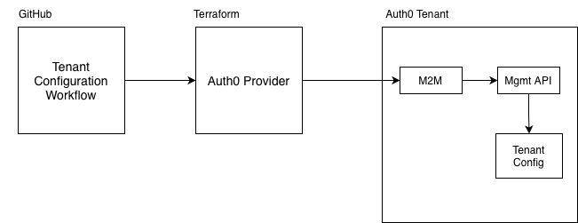
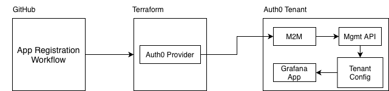
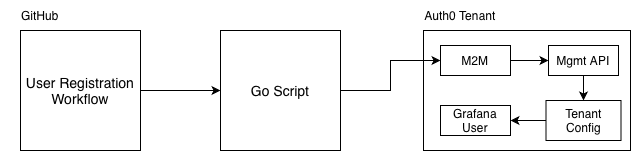

# Teleport Security Automation

This document outlines the proposed design to build workflows automation that can securely configure, add web applications, and users to an [Auth0](https://auth0.com) tenant, as a solution to the Teleport Security Automation [Challenge](https://github.com/gravitational/careers/blob/main/challenges/security-automation/challenge) (Level 3).

## 1. Scope

The solution focuses on implementing three Minimum Viable Product (MVP) [GitHub Actions](https://github.com/features/actions) workflows:

- A workflow that uses [Terraform](https://www.terraform.io) to configure an Auth0 tenant to enforce strong authentication for all its web applications.
- An additional workflow that uses Terraform to add Grafana OSS (with OIDC) as a web application to the Auth0 tenant.
- A final workflow that executes either a shell script or [Go](https://go.dev) program to register a sample user to the Auth0 tenant.

## 2. Infrastructure Configuration

### GitHub Repository Settings and Security

The `main` branch has a protection ruleset that enforces: 

- deletion restrictions
- requiring pull requests before merging
- blocking forced pushes
- use of `./github/CODEOWNERS` file
- a requirement of 2 approvals
- dismissal of stale reviews
- status checks that must pass (including `terraform fmt -check` and/or `terraform validate` workflow).

### Auth0

A `Machine-2-Machine` (M2M) application will be manually set up in the Auth0 free tier. The application's `client ID` and `secret` will be stored as GitHub Secrets. This M2M application will be granted least-privilege permissions to use the `Auth0 Management API`.

### Grafana OSS

Grafana OSS will be provisioned locally with its official [Docker image](https://hub.docker.com/r/grafana/grafana)  by using the services and settings specified in the following `docker-compose.yml` file:

```yaml
services:
  grafana:
    image: grafana/grafana
    container_name: grafana
    restart: unless-stopped
    ports:
      - '3000:3000'
    environment:
      # Enable Generic OAuth (OIDC)
      GF_AUTH_GENERIC_OAUTH_ENABLED: "true"
      GF_AUTH_GENERIC_OAUTH_NAME: "Auth0"

      # Auth0 OIDC settings
      GF_AUTH_GENERIC_OAUTH_CLIENT_ID: ${GRAFANA_CLIENT_ID}
      GF_AUTH_GENERIC_OAUTH_CLIENT_SECRET: ${GRAFANA_CLIENT_SECRET}
      GF_AUTH_GENERIC_OAUTH_SCOPES: "openid profile email"
      GF_AUTH_GENERIC_OAUTH_AUTH_URL: "https://${AUTH0_DOMAIN}/authorize"
      GF_AUTH_GENERIC_OAUTH_TOKEN_URL: "https://${AUTH0_DOMAIN}/oauth/token"
      GF_AUTH_GENERIC_OAUTH_API_URL: "https://${AUTH0_DOMAIN}/userinfo"

    volumes:
      - grafana-storage:/var/lib/grafana

volumes:
  grafana-storage: {}
```

### Secrets

Auth0 Management API credentials and any other workflow-related secret must be stored securely as GitHub Actions Secrets.

### Terraform

The Terraform providers version to be used for this project is: [Auth0](https://registry.terraform.io/providers/auth0/auth0/latest/docs) `1.36.0`.

> [!IMPORTANT]
> Please note that for this project Terraform state will not be persisted to a secure storage location. Instead, a binary file will be generated from `terraform plan` for `terraform apply` to process it immediately within the same workflow execution.

### Environments

This project will operate within a single development environment only, wherever required. No separate staging or production environments will be provisioned.

## 3. APIs

### Auth0 Authentication API

The [Auth0 Authentication API](https://auth0.com/docs/api/authentication) is the core interface for authentication and authorization flows in Auth0. The Grafana instance will need them for Auth0-based sign-on. Important endpoints are:

- `/authorize`
- `/oauth/token`
- `/userinfo`

### Auth0 Management API

The Auth0 Terraform provider uses the [Auth0 Management API v2](https://auth0.com/docs/api/management/v2) to automate tenant configuration, enforce authentication, user management, and any other required Auth0 asset management. Important endpoints are:

- `/api/v2/users`
- `/api/v2/tenants/settings`
- `/api/v2/clients`

> [!IMPORTANT]
> [Auth0 Rate Limits Policy](https://auth0.com/docs/troubleshoot/customer-support/operational-policies/rate-limit-policy/rate-limit-configurations/free-public) for free-tier tenants is understandably low but still useful for this project.

### GitHub Actions

GitHub Actions heavily utilizes the [GitHub REST API](https://docs.github.com/en/rest/actions/workflows) to interact with various aspects of GitHub and manage workflow execution. Workflows will consume this API for their executions.

## 4. Security Considerations

### GitHub

- No rotation policies for GitHub Secrets will be set up for this project.
- GitHub Actions used in workflows will be pinned to specific latest-stable versions.

### Terraform

- Terraform `apply` will be restricted to run on `merge` to `main`.
- Performing a manual change in the Auth0 Tenant account will effectively cause a state drift.

### Auth0

Tenant security features to be enabled are:

- Breached Password Detection
- Brute-Force Protection
- Suspicious IP Throttling
- Multifactor Authentication (all users)
- Refresh Token Rotation (Grafana app)

In conjunction, I think, they provide enough coverage for these security areas: Credential Hygiene, Attack Surface Hardening, Network & Access Control, Account Protection, and Session Management.

Also, least-privilege principle should be used when selecting Auth0 Management API `scopes` accordingly for each use case to be implemented: tenant-configuration, app registration (Grafana), user registration (Script). Scopes to be used are:

#### Tenant Configuration:

- `read:attack_protection`
- `update:attack_protection`
- `read:tenant_settings`
- `update:tenant_settings`
- `read:guardian_factors`
- `update:guardian_factors`
- `read:mfa_policies`
- `update:mfa_policies`

#### App Registration:

- `read:clients`
- `read:connections`
- `create:connections`
- `create:clients`
- `update:clients`
- `update:connections`

#### User Registration:

- `read:users`
- `create:users`
- `create:guardian_enrollment_tickets`

## 5. Edge Cases

No failover or redundancy mechanism will be enabled for automatic recovery to the following scenarios, which will definitely impact the system if they occur:

- Auth0 backend outages that affect workflows executions
- Expired Auth0 client secrets
- GitHub Actions runtime problems
- Auth0 dependencies ordering issues

## 6. Implementation Details

This project aims to implement the following tenant, app, or user configuration/assets within Auth0:

### Workflow 1: Auth0 Tenant Configuration

**tenant-configuration.yml**: Configures an Auth0 tenant to enforce strong authentication for all its web applications.

- Tenant-wide configuration:
    - Breached Password Detection
        - Status: Enabled
    - Brute-Force Protection:
        - Status: Enabled
        - Maximum Attempts: 5
        - Mode: Block
    - Suspicious IP Throttling
        - Maximum Attempts: 50
    - Multi-factor Authentication (globally enforced for all users)
        - Policy: All-applications
        - Factors enabled: WebAuthn with FIDO Device Biometrics
    - Show Factors: OFF

#### Components/Flow:


### Workflow 2: App Configuration

**app-registration.yml**: Adds Grafana OSS (with OIDC) as a web application to the Auth0 tenant.

- App configuration:
    - Grafana OSS with OIDC
        - Local Logins & Sign-Ups: Disabled
    - Users Connection DB
    - Users Accounts Password Policy:
        - Password Strength: Excellent, minimum 15 chars length
        - Password History: 7
        - Password Dictionary: Enabled
        - Personal Data: Disallow
    - Refresh Token Rotation
        - Token Lifetime: 7200 (2 hours)
        - Expiration Type: Expiring
        - Rotation Type: Rotating

#### Components/Flow:


### Workflow 3: User Configuration

**user-registration.yml**: Executes a Golang program with [Auth0's Golang SDK](https://github.com/auth0/go-auth0) to register a sample user to the Auth0 tenant. After user creation, a password reset email for that user will be triggered by POSTing to the `api/v2/tickets/password-change` endpoint in Auth0's Management API.

- User:
    - Add sample Auth0 Tenant User
    - Basic retries and error handling

#### Components/Flow:



#### Code Structure

Expected code organization will be:

```sh
├── .github/workflows
│   ├── app-registration.yml		# 1
│   ├── tenant-configuration.yml	# 2
│   └── user-registration.yml		# 3
├── auth0
│   ├── apps				        # 4
│   │   ├── grafana.tf
│   │   ├── providers.tf
│   │   └── variables.tf
│   └── tenant				        # 5
│       ├── config.tf
│       ├── providers.tf
│       ├── variables.tf
│       └── actions
│           └── mfa.js
...		
└── scripts				            # 6
    └── user-registration.go
...
```

With possibly 3 PRs distributed as:

- PR 1: Items 2, 5
- PR 2: Items 1, 4
- PR 3: Items 3, 6
