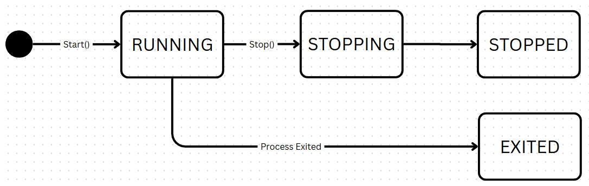

# Job Manager - Design DOC

## Overview

This document describes the design for a Job-Service that starts, stops, monitors and streams output from Linux processes via gRPC.

### Goals
* Provide a reliable abstraction for starting, stopping, and monitoring Linux processes.
* Ensure correct process lifecycle management, including well-defined state transitions.
* Support binary-safe streaming of process output.
* Allow multiple concurrent clients to observe job output.
* Expose a clear, minimal, and well-defined gRPC API.
* Maintain strong concurrency that avoids data races, deadlocks, and goroutine leaks.


### Non-Goals
* Persisting job state or recovering jobs across service restarts.
* Implementing advanced scheduling, queuing, or prioritization of jobs.
* Providing a fully configurable system.

### Terminology

* **Job**   - A unit of work managed by the system and mapped to a Linux process.
* **Process** - An operating system process. Each job owns exactly one process.
* **Job Service**  - The long-running server responsible for managing jobs, capturing output, and exposing an API.
* **Worker Manager** - The in-process component that owns job state, lifecycle management, and output coordination.
* **Output Log**  - A log that persists stdout and stderr output.
* **Subscriber**  - A consumer of job output.

***Unless otherwise specified, the terms “job” and “process” are used interchangeably in this document, with “job” referring to the system-level abstraction and “process” referring to the underlying OS entity.***

## Design Challenges

### Job Lifecycle & Process Management
#### Challenge
Starting out it’s important to nail down the lifecycle of a job. Jobs may exit immediately, fork children, quit unexpectedly, or a myriad of other possible things. The system must ensure the correct state transitions, avoid leaking processes, and remain robust under concurrent operations

#### Approach
Each process will be executed in its own process group to ensure all children processes (if present) can be terminated together. The job lifecycle is modeled as a state machine. Once a process is started successfully the job enters the running state and will not stop until it either completes or is signaled to stop. If a job is signaled to stop, it transitions to the stopping state, sent a SIGKILL termination signal, then transitioned to stopped. If a job exits naturally without being stopped, it transitions directly from Running to Exited.

#### Notes
* When a job is successfully started a dedicated goroutine waits on the process to exit and is responsible for signaling job completion and transitioning jobs to the Exited state.
* Job termination will be idempotent. Each job will be guarded by a stop once mechanism to prevent duplicate stop attempts.



### **Output Capture, Streaming, and Subscription**
#### Challenge
The system must stream job output to clients while satisfying several constraints. Output must be available from the start of execution. Multiple clients must be able to consume output concurrently. The solution must avoid polling or busy-waiting and ensure that clients do not block job execution or output capture. Finally, the system cannot assume output structure.

To tackle this we must solve a few things.

* Job output emission
* Output fan-out
* Late client replay

#### Approach

##### Job Output Emission
Linux processes often emit output on both stdout and stderr. To preserve ordering, the job manager multiplexes stdout and stderr into a single byte stream, framing each record with a stream tag, payload length, and enforcing a maximum payload size of 32 KiB. This limit ensures predictable behavior under sustained or high throughput workloads.

Framed output is then appended to a log file, which serves as the source of truth for output replay.

```
Tag:
  0x01 → STDOUT
  0x02 → STDERR

Payload Length:
  Unsigned 32-bit integer
  Number of bytes in Payload

Payload:
  Raw bytes (Max 32 KiB)


  Ex.
  01 00 00 00 06 4f 55 54 2d 30 0a
  
   TAG - [01]          
   Payload Length - [00 00 00 06]
   Payload - [4f 55 54 2d 30 0a]

```
##### Output Subscriptions
In addition to persisting output, the output log coordinates delivery of output to active subscribers.

Each subscription corresponds to a single client stream and maintains its own read offset into the output log. Subscribers consume output by reading framed records from disk starting at their offset and streaming them to the client.

The output log tracks a committed length (total bytes appended) and uses a channel based notifier to signal when new
data is available. On each append, the notify channel is closed to wake all waiting subscribers, then a new channel is
created. "Waiting at EOF" is a derived state and a subscriber is waiting when its read offset equals the committed
length. Each subscriber reads until `offset == committedLen`, then blocks using a select on {notify, ctx.Done()}. This
allows subscribers to wake on new data, client disconnect, or log closure. Upon waking, each subscriber fetches the new
notify channel under the log's mutex, re-checks the committed length, and continues reading if new bytes are available.

On log close, the log closes the current notifier channel so that any waiting subscribers wake, drain the remaining
bytes, then exits.

Clients are treated as unreliable by default. A disconnect is observed via the gRPC stream context via ctx.Done() or
Send() returning an error. In either case, the handler returns then cleans up the subscriptions. Reconnections are
always treated as new subscriptions.

##### Late Client Replay

Clients may subscribe to a job's output after the job has already started or ended. To support this, each subscription
starts at offset 0 and streams framed records in order before tailing live data. Slow subscribers may fall behind, but
they do not block the writer, interfere with other subscribers, or impact job execution.

##### Shutdown and cancellation

When a job terminates, its output log is closed. Log closure signals all active subscriptions to stop tailing and exit once all available output has been delivered. Individual subscriptions may also terminate independently when a client cancels its request.

## Tradeoffs, Failure Modes, And Alternatives

### Output log
By using file storage replaying a jobs output becomes trivial and deterministic. But it also causes disk I/O to become part of the hot path for output capture. This is acceptable for the challenge scope and can be improved later. But it’s important to know where this could potentially break down.

* Failure modes
  * Disk Full: Output append may fail and truncate output
    * For this challenge, if persisting a frame fails, we log the error and continue running the job.
  * Client Churn: Frequent subscriber connect/disconnect may increase replay overhead
  * Disk Read Overhead: With N subscribers, the system performs N independent sequential reads over the same output log. This can increase I/O pressure and may lead to slowdown when N is large.
* Alternatives
  * Direct pipe stream to gRPC: rejected because it cannot support late subscribers replaying output from the beginning without buffering.
  * In-memory ring buffer: Considered to enable replay without disk I/O, but was rejected due to high-volume output causing the buffer to grow and either run into out of memory issues or overwriting history
  * Replay + in-memory fan-out: output is replayed from the persisted log and then transitioned to live streaming via in-memory fan-out. Rejected because slow or unreliable clients could fall behind and lose output once live fan-out begins.
* Future Work
  * Periodic garbage collection of exited job logs
  * cgroup disk IO limits
  * Per job output size cap

## gRPC API Spec
```
service JobService{
  rpc Start(StartRequest) returns (StartResponse);
  rpc Stop(StopRequest) returns (StopResponse);
  rpc Status(StatusRequest) returns (StatusResponse);
  rpc StreamOutput(StreamOutputRequest) returns (stream Output);
}

message JobSpec {
  string exe = 1;
  repeated string args = 2;
}

enum JobState {
  JOB_STATE_UNSPECIFIED = 0;
  JOB_STATE_RUNNING = 1;
  JOB_STATE_STOPPING = 2;
  JOB_STATE_STOPPED = 3;
  JOB_STATE_EXITED = 4;
}

message JobStatus {
  string job_id = 1;
  int64 pid = 2;
  JobState state = 3;

  // Unix nano timestamps (UTC)
  int64 started_at = 4;
  int64 ended_at = 5;

  int32 exit_code = 6;

  // String errors
  string wait_err = 7;
}

message StartRequest {
  JobSpec spec = 1;
}

message StartResponse {
  string job_id = 1;
}

message StopRequest {
  string job_id = 1;
}

message StopResponse {}

message StatusRequest {
  string job_id = 1;
}

message StatusResponse {
  JobStatus status = 1;
}

enum StreamTag {
  STREAM_TAG_UNSPECIFIED = 0;
  STREAM_TAG_STDOUT = 1;
  STREAM_TAG_STDERR = 2;
}

message Output {
  StreamTag tag = 1;
  bytes data = 2;
}

message StreamOutputRequest {
  string job_id = 1;
}

```

## CLI

```sh
Usage:
  jobctl [command]

Available Commands:
  help        Help about any command
  start       Start a new job
  stop        Stop a running job
  status      Show job status
  stream      Stream job output

Flags:
      --addr string          gRPC server address (default "127.0.0.1:9000")
      --ca string            CA bundle (default "certs/ca.crt")
      --cert string          Client certificate (default "certs/read.crt")
      --key string           Client key (default "certs/read.key")
  -h, --help                 help
      --timeout duration     Request timeout (default 30s)

ex. 
./jobctl start --exe /bin/echo -- replay-test
./jobctl stream abca1c5d-8f74-447f-82b3-a843d2492d6a
./jobctl stop 417081e0-5a99-427e-9a7b-b689f0eecc2d
```

## Security
### Transport security (mTLS)
For this project my goals are to minimize potential attack surface, configuration errors, and difficulty,  so I chose TLS 1.3 with Go’s Defaults. This allows me to remove all the complexity and use Go’s vetted ciphers.

### Certificate issuance and verification
certificates are pre-generated using a private CA:
* A single self-signed root CA is created and used to sign all server and client certificates.
* The CA certificate is distributed to both the server and CLI as a trust anchor.

**Server certificate**
* Signed by the private CA
* Contains a DNS SAN matching the expected server hostname
* Presented by the server during the TLS handshake

**Client certificates**
* Each client (CLI) has its own certificate and private key, signed by the same CA
* Client certificates include identity attributes used for authorization (see below)

During the TLS handshake:
* The server requires and verifies the client certificate (`RequireAndVerifyClientCert`)
* Certificate chain validity, expiration, and signatures are verified by the TLS stack
* Connections without a valid CA-signed certificate are rejected before reaching application logic

On the client side:
* The client verifies the server certificate chains to the trusted CA
* The server’s SAN must match the expected hostname, preventing accidental or malicious misrouting

Certificates are static for this challenge and will be added to the repo. Also note for local development and review, the server certificate includes a DNS SAN of localhost

### Certificate Identity Validation

In addition to cryptographic verification, the service validates certificate identity claims used by the authorization layer:

* Role derivation: The client role is derived from the certificate’s Subject.OrganizationalUnit (OU). The certificate must contain exactly one OU value, and it must be one of {Admin, Read}, otherwise the request will be rejected

### Authentication → Authorization Flow
Authentication is established by the mTLS handshake. Authorization is enforced per-RPC via gRPC interceptors by extracting the peer certificate from the request context and mapping role → allowed RPC set.

#### Role model
* Admin: full access to all RPCs (start/stop/status/get-output/stream-output)
* Read: read-only access (status/get-output/stream-output)

#### Future Work

* Client Type Hardening: In production a service should additionally require an allow listed URI SAN to identify the CLI to prevent malicious workloads from reusing a valid certificate.
* Certificate Revocation: certficate revocation is not directly handled in this challenge but should be consider. Ideally we would rely on short lived certificates and rotate depending on the requirements  
